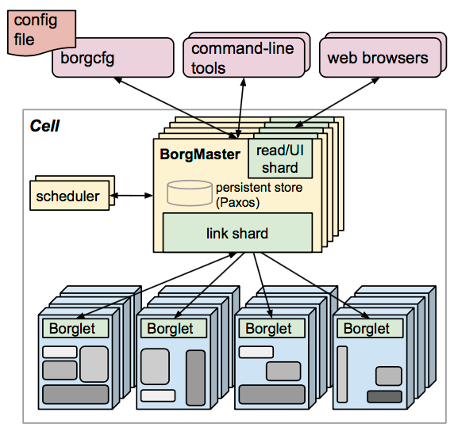
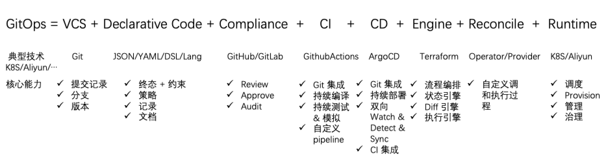
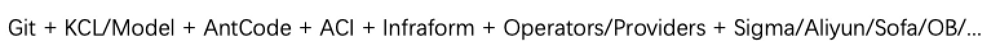
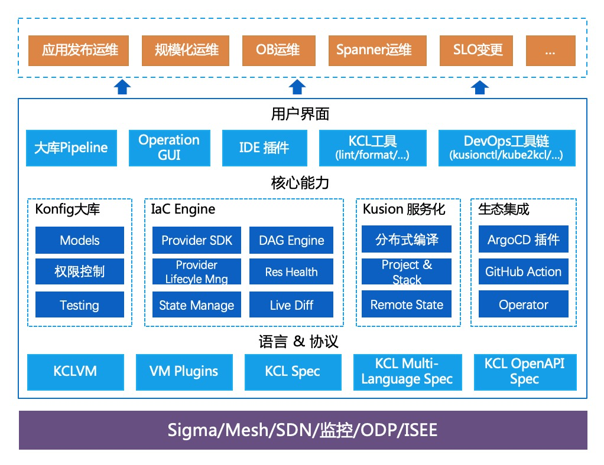
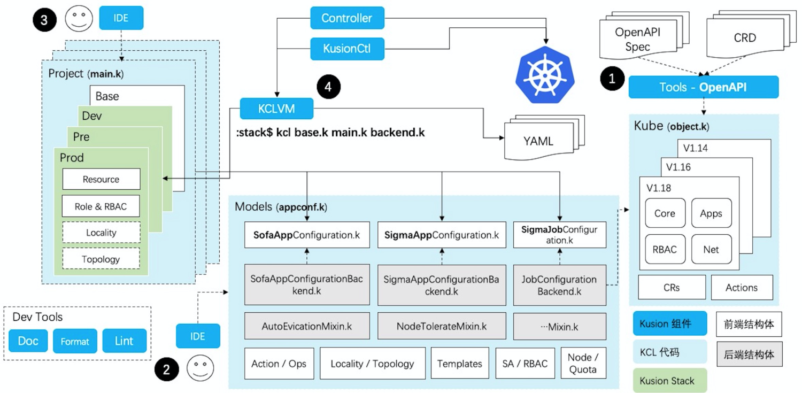
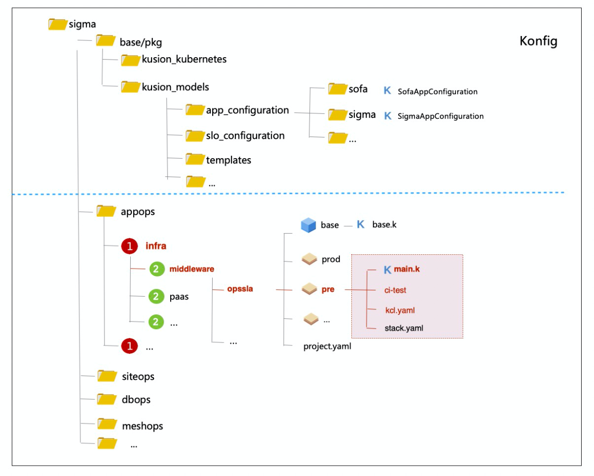

## 1. 背景

蚂蚁运维系统经过多年发展仍然面对着持续变化的挑战，典型痛点总结如下：

- 蚂蚁内部技术栈多样化（计算、数据、业务应用），“非标”应用运维长期缺少系统支持方式
- 蚂蚁自身需要考虑在各种场景下从基础设施到 SaaS 的交付运维成本及效率
- 金融云运维体系发展变迁在域内的遗留问题造成的差异性导致的效率、体验问题
- 云原生技术落地需求对运维产品在效率、架构方面造成的冲击
- 信创及基础设施国产化落地需求对运维系统的诉求难以快速满足
- 强监管形势下混合云管理造成的多样性、差异化、独立性、临时性需求对运维体系的冲击

同时内部运维产品建设投入吃紧、各系统体验水位差异较大、平台间的集成问题、社区技术难以落地等问题，对运维系统研发人员和使用方造成负担。

## 2. 目标

在这样的问题背景下，我们希望能借助 IaC 理念及技术栈构建更开放、更高效的 PaaS 平台，同时利用有限的平台侧研发资源满足两个关键目标：

- 满足蚂蚁规模化、多样化、差异化、高复杂度运维场景下高时效性的运维需求
- 在强监管新常态下的保证运维体系的独立性、可移植性，满足混合云场景高敏捷性的运维需求

我们希望能构建一套满足蚂蚁内部多团队、多项目（应用）、多租户、多环境、多运维场景需求，依托于多种运行时、多集群、多云平台的轻量化运维技术栈及平台产品。

## 3. 思路

### 3.1 高度开放的运行时

实际上技术社区已经给了我们非常多的思路和方案。在云原生运维时代，诞生了一批资深 YAML 工程师，通过定义、复制、生效配置来运维云原生应用、infra。而这种工作模式的基础是云原生管控运行时高度开放、高度可配置的设计模式——这也是云原生技术的底层逻辑之一。运行时在设计思路上更像一种开放的能力层，尽可能通过资源化、自包含、自解释的基础能力描述与上层业务解耦，同时也为上层业务定义预留了空间和可能性。



受 Borg 体系（上图）设计及工程实践的影响，Kubernetes 保留了其 [部分设计思路](https://queue.acm.org/detail.cfm?id=2898444)。不同之处在于由于其自身定位， Kubernetes 把大量精力投入在了 API 规范、扩展机制（CRD、Aggregated APIs……）及开放的资源状态持续调和机制（Operator）等方面。通过把控制边界约束在能力 API 层，从而将更上层的技术、工具、服务的定义空间交给社区。然而如何在不同规模、不同玩法的团队推进统一的配置管理技术及工程实践并不是一个简单的话题（这也是一个开放的难题）。

虽然仍有未结的难题，但 Kubernetes、Istio 等云原生项目的成功推动了这种以声明式 OpenAPI 为基础的运行时控制面 API 设计思路的普及。越来越多的经典服务开始向云原生社区定义的诸多 API 协议对齐，例如调度系统、文件系统、网络系统“兼容” Kubernetes APIs 标准，而服务控制面则宣布支持 UDPA 描述规范。即使在没有对应的参照物情况下，这样的思想、方式和技术组件被越来越多的借鉴使用。可以说高度开放、高度可配置、自洽自包含、面向资源的基础能力运行时 API 设计是云原生技术推广普及形成的一种技术趋势。

### 3.2 一致的现代运维架构

GitOps 理念由 Weaveworks [提出](https://www.weave.works/blog/what-is-gitops-really)后，被各厂商及企业广泛[讨论和发展](https://www.gitops.tech/)，现已成为众多主流云平台及企业内部现代化运维架构的基础思路。在真实的企业运维场景中，我们通常面对着多种角色的用户群体，多种差异流程需求，多种运维操作场景，多种职能的运行时（例如 IaaS、Kubernetes、SOFA、OB 等）等不同的需求。我们希望能通过一致的、现代的思路运维及管理多种运行时，结合 GitOps 的理念，可以将抽象的典型流程总结如下。



首先通过现代化的 VCS 源代码版本管理系统，我们可以获得配置分支管理及版本化的便利，通过声明式的代码可以定义对运行时期望的、确定的描述，并通过充分的约束保证描述代码自身的正确性。此外，我们可以通过策略代码定义目标运行时在出现非确定状态时的处理逻辑。相对于多种运行时，这些约束、策略代码更多工作在“编译时”，因此可以前置于运行时研发、测试、编译，最终通过某种数据交互形式（如 YAML、内存）、运行时库调用（如 wasm module）等方式与运行时集成。在团队协同场景下，代码管理平台提供了评审机制，在大多数情况下可以替代运维产品中双因子、多因子验证等功能。

这些声明式代码作为一个唯一的面向大众的“公示牌”，是一种可回放的记录、可传阅的文档，其中定义了决定不同运行时状态的关键数据及逻辑。这些声明代码通过 CI 系统完成测试、验证及编译过程，并作为输入通过 CD 系统驱动执行引擎完成对运行时的同步。具体来说引擎在状态机的驱动下，通过适当的调和方式完成对应目标资源组的变更。CD 系统通过持续双向 watch & diff，在代码声明状态与运行时状态不匹配时通过预配置的同步策略完成对运行时的调整，保障运行时与“公示牌”的一致性、防止配置漂移。

在这样一致的工作流程框架下，通过合理的工程技术方式，我们可以更简单、高效的应对多团队、多项目（应用）、多租户、多环境、多运维场景的需求，同时完成对多种运行时、多集群、多云的统一交付、管理。

## 4. 实践
### 4.1 统一架构及工作流程驱动多种自动化场景

基于以上技术思路，结合蚂蚁内部技术平台实践，我们做了如下实践：



其中重点组件包括：

- KCL：一种以声明式为主要范式的配置、策略专用编程语言
- Models：由 KCL 编写的开箱即用的模型库，通过它们可以简化对应用、基础设施的声明定义
- AntCode：通过 AntCode 平台研发协同，并维护了统一运维代码库 Konfig 及其配套
- ACI：蚂蚁内部的自定义 CI 机制，支持声明式的 CI 配置及扩展插件编写
- Infrafrom：IaC 发布运维系统，内置了 Kusion 基础服务
- Runtimes：蚂蚁内部的诸多运行时，如云资源运行时、容器及应用内核运行时、服务及应用运行时、数据库运行时等

我们将基础能力整合为基础平台软件栈，持续推进研发迭代，尝试通过发行版的方式交付落地，服务多种运维场景及项目。



我们通过对运行时 API 的代码化、抽象、配置的三步过程完成对核心模型及业务逻辑的定义，通过自动化集成完成对运行时的调和，这样的工作流程为多种运行时的运维管理提供了统一的思路和逻辑，同时开发研发的模式大大提高了业务层建设的参与并行度。下图展示了基于 Kusion 的整体工作流程。



### 4.2 统一运维代码库助力共享沉淀

我们通过目录、代码的简单工程方式可扩展的支持多团队、多项目、多租户的研发协同，通过 Konfig 大库共享和复用代码，以简化依赖管理和代码升级。在 Konfig 仓库中，我们在根目录区分基础配置与业务配置，其中基础配置包括共享配置模板及数据，业务配置则包括了应用运维、数据库运维、IaaS 运维、建站运维等多种运维业务场景。其中在业务配置中通过组织架构/项目的思路来组织分属于多团队的应用及非应用项目。基于这样的工程结构，结合 AntCode 丰富的功能特性，我们添加了权限隔离、代码评审、自动合并、ACI 流水线等功能支持，建设了适应不同运行时的 GitOps pipelines。当用户代码提交完成后，通过在 pipeline 中引入代码检查和配置测试保证正确性，同时提升基础设施配置的稳定性；经过测试验证的代码最终通过 pipeline 的驱动在运行时生效。



通过 AntCode 平台提供的研发协同能力，应用研发与 SRE 同学可以更好的协同保证应用描述的正确性。


通过平台研发、SRE、应用运维多团队持续的提交，大库中逐渐沉淀了宝贵的数据和经验，基于此我们可以更简单的将已有经验推广到不同场景，也可以帮助不同群体更快理解积累过程和当前状态。

### 4.3  统一声明式代码描述运维业务

我们通过 KCL 描述配置的期望终态及其约束，尽可能的保证声明式、强约束、编写便利、统一规范、安全稳定的平衡。

一个简单的例子，我们可以通过如下代码定义我们的应用基础信息（如下图），配置编写遵循 `key = value`的简单范式。 

```json
app = {
    name = "myApp"
    image = "app/image"
    replica = 2
    resource = {
	      cpu = 4
        memroy = 8Gi
        disk = 50Gi
	  }
    ...
}
```

这样的配置数据有可能出错，一旦出错则会造成非预期的运行时执行结果。我们通过一个结构定义来约束这些配置数据。KCL 希望通过静态化的语言技术在编译时暴露更多问题，吸收了代数类型的思路将配置合法值的定义与静态类型设计结合，来完成编译时的数值检查，同时支持通过 `check`代码块自定义静态、动态约束规则。

```python
schema App:
    name: str
    image: str
    replica: 2 | 4 | 8 | 16 
    resource: Resource

schema Resource:
    cpu: 2 | 4 | 8 | 16 | 32
    memroy: 4Gi | 8Gi | 16Gi | 32G
    disk: int 

    check:
        0 <= disk <= 100Gi
```

基于 schema 的配置只需在原配置上修改一行即可（如下图）。当配置数据出错时，KCL 会通过编译时错误提示用户，避免对运行时的影响。

```python
app = App {
    name = "myApp"
    image = "app/image"
    replica = 2
    resource = {
       cpu = 4
       memroy = 8Gi
       disk = 50Gi
    }
    ...
}
```

此外 KCL 提供了诸多支持多团队、多租户、多环境的模块化、分块编写的便利功能。由不同角色用户编写的配置在编译器内存中组装成一张配置之间的依赖图，编译器通过逻辑代换完成图中每个节点值的计算。同时 KCL 支持必要的动态功能和内置函数，支持定义魔术变量及编写 plugin 增强集成能力，以支持内部相对复杂的协同编写扩展、集成诉求，同时保证难以用 KCL 写出于其核心目标无关或不安全的代码。统一的编写范式和约束方式，统一的运维代码库，为我们长期治理维护提供了极大的便利。KCL 核心模块采用 Rust 编写，提供了高性能的运行时，为自动化集成提供了基础保障。此外，KCL 也被使用在中间件配置校验等其他场景中。

此外，我们针对蚂蚁域内的场景提供了开箱即用的**模型库**，由平台团队与 SRE 团队协同研发维护，包括对应用交付运维的描述，对各类基础设施运维的支持，对建站站点的描述等大量有价值的运维业务模型定义。通过将运维业务外置、前置到“编译时”，服务运行时可以保持抽象化、引擎化，避免与大量业务逻辑直接耦合后而降低运行时研发交付的敏捷性。这些模型由将由 SRE 团队主导长期维护，帮助运维端使用者快速开始，缩短使用路径。

### 4.4 服务 & 产品化加速自动化集成

Kusion 提供了丰富的 API 支持自动化集成，使得 KCL 代码可以集成到更多自动化流程中。

KCL 自身提供 **多语言 API**，支持对 KCL 代码做 “CRUD”，这也是基线元数据代码化的基础之一。在 KCL 设计中，通过 `package path : key path`的模式支持对任意配置键值的索引，从而完成对任意键值的增删改查。例如对于上图中的 KCL 代码，我们可以通过如下 Golang 方法调用完成对 `disk`值的修改：

```go
OverrideFile("main.k", []string { 
    "__main__:app.resource.disk=30Gi"
})
```

除了 API，我们也可以通过命令行达到一样的目的：

```shell
kcl main.k --overrides __main__:app.resource.disk=30Gi
```

此外，Kusion 提供了自包含的服务层 API，包括 `init`、`compile`、`plan`、`apply`、`destroy`等原子操作。`Init`帮助用户通过不同的业务模板快速开始，`compile`将 KCL 代码编译为多种目标数据格式、运行时形态， `plan`负责分析出当前配置声明与 runtime 之间的 diff，`apply`则可以将变更的配置生效，通过这些服务可以更简单的研发基于 Kusion 能力的运维产品。

### 4.5 工具帮助日常及非标场景提效

作为 2 Dev 技术栈，除了语言与 API、Kusion 工具集提供了丰富的工具协助用户在不同场景完成其工作。

针对运维场景，用户可以通过 KusionCtl 配合模型库完成其日常工作，通过 `init`、`plan`、`apply`、`destroy`的操作原语完成对不同场景的操作。相比完整的自动化流程，这样的工作流程也更简洁灵活。


此外 KusionCtl 重视操作可视化及体验，希望给用户稳定、高效的操作体验。视频展示了如何通过 KusionCtl 初始化一个工程并在集群部署应用。

此外 Kusion 工具集提供了针对 OpenAPI 的自动化生成工具，支持 OpenApi Spec、Kubernetes CRD、多语言 OpenApi binding 到 KCL 代码的转换；提供了多种 IDE 插件支持，支持的 IDE 包括 IDEA、VSCode、AntCode、Github 等常用研发工具及平台；针对 KCL 编写场景提供了 format、test、lint、docgen 等工具以简化开发。

## 5. 场景

在 21 年我们探索了蚂蚁域内多种运维场景，迈出了技术投产的重要一步，并得到了一定的提效收益和场景积累。

### 5.1 应用运维

我们将代码化的技术思路与云原生发布相结合，通过 KCL 描述应用基线，描述基础设施，基于 Kusion 服务化引擎建设了云原生运维产品，服务了 450+ 应用，包括标准 SOFA 应用，一批非 SOFA 应用，并覆盖了基础设施运维场景。这些应用包括了多样的云原生基础设施、数据基础设施，支持了国产化运维需求的快速落地，这些在蚂蚁内部的 “非标” 运维需求在过去很难得到快速响应和资源投入。同时通过服务不同 BU 不同项目不同租户/站点，Kusion 为面向多团队多项目多租户多环境多运行时多云平台运维提供了技术支撑。面向未来，我们将持续推进基线代码化，无差别的支持全应用类型的发布需求。

### 5.2 SLO 监控

在 2021 年中间件团队积极探索服务能力 SLO 的定义和落地，希望通过合理的 SLO 机制量化服务可用性，更好的与 SRE 团队协作。通过 Kusion 技术栈，中间件同学完成了对 SLO 的描述，打通了接入 AntMonitor 监控能力的端到端流程，将 SLO 的想法快速落地并复制到了蚂蚁域内主站、网商、保险、国际、芝麻、消金一期等内部及跨站场景，在没有专项管控平台研发支持的情况下取得了超出预期的业务结果。面向未来 SLO、自定义监控、自愈等服务可用性定义都将通过代码化的方式定义管理，并逐步交给 SRE 同学长期维护。
 
### 5.3 建站

建站平台通过多年建设、积累沉淀了大量建站编排流程定义及业务逻辑，作为集成平台对接了 100+ 服务，形成了其难以替代的业务定位。但差异化租户长期积累的业务逻辑使得建站平台面对着沉重的技术债，架构灵活性、扩展性的不足，业务研发敏捷性差，需求侧、平台侧快速变化的大环境，都使得建站平台自身疲于应对，长期处于建站在哪建，建站平台同时在哪开发的情况。针对这些问题，建站平台通过基于 Kusion 技术栈的改造，将租户/站点间的差异性、易变的业务逻辑及编排流程定义从平台剥离到 Konfig 大库，同时通过 Kusion provider 机制动态集成外部服务，大幅提升了架构的灵活性和可扩展性，提升了租户建站准备效率及建站临场处理的灵活性。同时面向非标、过渡性建站场景，平台侧建设成本降低 90%，最终 SRE 通过 Kusion 工具的协助加速了建站工作。面向未来，以单应用运维为原子，建站平台将继续探索基于 Kusion 技术栈的解决方案，满足主站、ATS、非标场景的差异化建站的高效建站要求。

### 5.4 ATS

ATS（蚂蚁可信原生服务区）定位为未来蚂蚁基础技术的底座，服务于域内及跨站的专用站点场景，在场景上面对较大的不确定性，对运维能力的独立性、可移植性、灵活性提出了非常高的要求。我们正在基于 Kusion 技术栈构建围绕应用的 `Image + Konfig + Tools`的最小集交付模式，将不可变镜像与灵活配置相结合以适应不同租户、环境的上下文，使得蚂蚁的应用可以更灵活的在不同站点交付、运维，并在不同的场景站点间快速复制、移植。目前基于 Kusion 技术栈 ATS 应用入驻已完成初步的探索验证工作，22 年将完成阶段性的建站工作，并服务于消金、征信的重要业务场景。

## 6. 总结


2021 年内我们推进了开放协同运维体系整体性的能力建设，在业务场景上覆盖从 IaaS 到 SaaS 运维的多场景验证落地：接入 450+ 应用，覆盖 15 个 BU；在基础能力方面覆盖网络策略、SLO 监控、Spanner/Mosn 运维、OB 运维等场景；助力主站、ATS 建站交付，支持银数一期非标交付场景；支持 K8S 及其他多种运行时；期间共引入 100+ SRE & 研发同学参与建设，积累了 2500+ CR，~7000 次 commit。虚拟项目组各子项目均完成既定目标，部分子项目完成了运维工作由技术研发到 SRE 的交接。同时 Kusion 作为基线代码化、ATS 建设、多云等重点项目的长期技术载体。在反思方面，由于对落地改造事项中的困难评估不足，及研发团队阵型不稳定，对技术工作和落地的完成度有一定影响，同时整体的质量、体验、架构等方面都需要在 CY22 持续提升。

通过我们不断完善的开放运维机制，我们希望促进各运维参与方合作关系的合理化，促进运维数据及知识的沉淀积累，促进基于配置代码的自动化，以达到整体协作运维效率的不断提升。在蚂蚁内部运维场景多，运维链路复杂，每个环节都需要最懂运维业务的 SRE 密切参与，与平台侧、应用运维侧协同工作，最终联合在一起形成完整的运维体系，在这样的思路下开放协同也会越来越重要。平台研发、SRE、应用研发多种角色协同编写的代码是一种数据的沉淀，业务知识的沉淀，基于这些数据和知识未来会有更多的可能性。

## 7. 展望

### 7.1 开源

语言、工具等基础性、生态性技术需要更广阔的空间长期发展，我们将在 22 年上半年逐步**开源** Kusion 的核心部分，在云原生运维、基础设施管理、领域语言等多个技术社区推广，并在外部公司推广使用，为 Kusion 发展吸收更多场景，挖掘更多的可能性。在云原生运维领域，我们将探索 Kusion 与开源技术集成的更多可能性，使 Kusion 接入到更多应用场景中；在基础设施管理领域，将兼容 TF 等成熟项目标准，以一种新的编程技术的方式补充已有生态；在领域语言方面，提升语言的编写体验，结合场景的技术、理论创新，集成多种 DSL 及 PL，社区推广布道，加强约束及策略编写能力等都需要持续努力突破。

### 7.2 体验优化

22 年的另一个重点工作是优化打磨语言、工具、服务、运维产品的**质量与体验**，建设高水准的可编程基础设施开放能力层及相关运维产品；持续提升整体用户体验，特别是优化前 15 分钟的使用体验，提升用户的自助使用率 ，提升产品使用的顺滑程度。我们希望通过基础能力建设形成运维生态的虚拟研发团队，众人合力服务更多场景。

### 7.3 架构现代化

通过 21 年的工作我们看到运维基础设施正在发生一些结构性的变化，但远未达到我们期待的终点，22 年将继续推进 GitOps 整体性建设，围绕**应用运维全生命周期**的代码化、多云等关键目标开展工作。在基线代码化方面，我们将推进代码化与不可变基础设施目标的深度结合，使得不可变镜像得以 “shipping” 到更多运行时环境中。在自动化效率方面，我们将持续推进自动化 CI，双向 CD 的技术探索和场景逻辑。在稳定性方面将通过静态代码扫描分析基线元数据变更对应用层的影响范围，提高基线的变更精度，降低影响面及爆炸半径。在多云支持方面，我们希望通过代码化提供统一的编程界面及多云对接的引擎及接入能力。最后我们希望尽可能发挥面向终态声明的价值，能在规模应用快速恢复场景找到突破口。

### 7.4 商业化的可能

在内部落地过程中我们探索出了一些未能预料的有价值的场景，在与外部社区、公司交流的过程中我们也发现，不论是线下研发测试还是线上交付运维，我们在内部领域场景遇到的问题有普遍性，社区及商业公司也都在领域中探索更好的技术和解决方案。在 22 年希望能在建设开源版 **OpenCore** 并在外部公司使用推广的同时，积累对企业服务、SaaS 化思考，做好商业化的准备。

## 8. 致谢

在 21 年整体性实践落地过程中我们遇到了不少困难和挑战，所幸虚拟项目组的同学们共同努力。衷心感谢项目组同学的鼎力支持和默契合作，但由于篇幅所限不能全部附上，特别致谢（排名不分先后）：

- 基础平台 & 应用运维：感谢何子波、杨英明、史贵明、李大元、刘星宇、牛旭、刘宏、王子剑等同学一如既往的并肩合作和付出
- SLO 监控：感谢 罗中惠、邱伟庭、Xu-Boliu 等同学的信任和共同探索
- SRE 中台 & 建站：感谢 李洋、司云帆、李治玮、王飞 等同学的强力支持和共同努力
- ATS：感谢 王召京、陈喜、黄家琦 等同学的加班加点的付出和支持
- DRM：感谢 蔡木庆、吴克柱、邵俊雄 等同学的支持与合作
- OB 运维 & ISEE 运维: 感谢 徐凯、王靠、马天奇 等同学的高度配合和场景输入
- Spanner & AntSDN：感谢 陈逸凡、郑昊、乔鑫、丁乾、杨昭宇 的积极探索、敢于变化
- 质量：感谢 周营、王钦玉 耐心细致的质量工程建设
- Antcode & Aci & CloudIDE：感谢效能同学 郑韵芝、刘仁权、邹山、解玮、彭娟、王兴龙、郭文俊 等同学的大力配合和支持

感谢所有给予我们支持和帮助的同学，最为重要的是感谢在 Kusion 及 IaC 运维技术、工具、产品尚未成熟阶段跟我们一起踩坑一起解决问题的用户们，CY22 我们继续携手共进。

## 9. Reference

- Borg, Omega, and Kubernetes：[https://queue.acm.org/detail.cfm?id=2898444](https://queue.acm.org/detail.cfm?id=2898444)
- What Is GitOps：[https://www.weave.works/blog/what-is-gitops-really](https://www.weave.works/blog/what-is-gitops-really)
- GitOps Tech: [https://www.gitops.tech/](https://www.gitops.tech/)
