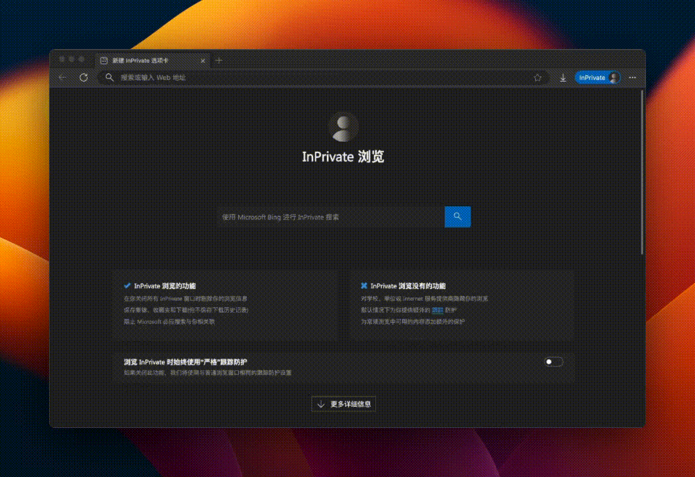

## Prerequisites

* Ensure [kubectl](https://kubernetes.io/docs/tasks/tools/) is installed.
* Ensure [helm](https://helm.sh/docs/intro/install/) is installed.
* If you do not have a ready-made cluster, you still need a [kind](https://kind.sigs.k8s.io/docs/user/quick-start/#installation/).

## Create Cluster (Optional)

First, if you do not have a ready-made cluster, you need to create a kubernetes cluster in your local environment with the `kind` tool. Follow these steps:

1. Create a cluster. You can create a cluster named `demo-cluster` using the following command:
   ```shell
   kind create cluster --name demo-cluster
   ```

   This will create a new Kubernetes cluster in your local Docker environment. Wait for a moment until the cluster creation is complete.
2. Verify that the cluster is running properly by executing the command:
   ```shell
   kubectl cluster-info
   ```

   If everything is set up correctly, you'll see information about your Kubernetes cluster.

## Installation

To install Karpor, execute the following command in your terminal:

```shell
helm repo add kusionstack https://kusionstack.github.io/charts
helm repo update
helm install karpor kusionstack/karpor
```

For more installation details, please refer to the [Installation Documentation](2-installation.md).


## Access Karpor Dashboard

1. Run the following command to access the Karpor service running in the cluster:
   ```shell
   kubectl -n karpor port-forward service/karpor-server 7443:7443
   ```

   After executing this command, if you access port 7443 on your local machine, the traffic will be forwarded to port 7443 of the karpor-server service in the Kubernetes cluster.
2. Open your browser and enter the following URL:
   ```shell
   https://127.0.0.1:7443 
   ```

This will open the Karpor Web interface. 👇



Congratulations! 🎉 You have successfully installed Karpor. Now you can start using Karpor to explore and gain insights into resources across multiple clusters.

## Enable RBAC when installing karpor (optional)

To facilitate users in quickly getting started with Karpor, the RBAC (Role-Based Access Control) authentication feature of `karpor-server` is disabled by default. This means that `karpor-server` will accept all requests. However, this approach can introduce significant risks in a production environment. We strongly recommend using RBAC authentication to protect data security when deploying Karpor in a production setting.

For detailed instructions on RBAC authorization and tokens, please refer to the [How to Create Token](../3-user-guide/1-how-to-create-token.md) documentation.

## Register Cluster

To register a new cluster with Karpor, follow these steps:

1. Log in to the Karpor Web interface using the token created in the previous step.
2. Navigate to the `Cluster Management` section in the Karpor UI.
3. Click on the `Register Cluster` button.
4. Follow the on-screen instructions to complete the registration process.

5. When registering a cluster, please note the following:

   - The cluster name must be unique and cannot be changed once created.
   - Ensure that there is network connectivity between the server address (target cluster address) in the uploaded cluster certificate and Karpor.
   - If you deployed Karpor in a local cluster and want to register that local cluster, you need to modify the server address in the cluster certificate to the internal cluster address `https://kubernetes.default.svc.cluster.local:443` to ensure that Karpor can directly access the target cluster.
   - If you want to register an EKS cluster, additional configuration of the KubeConfig is required, including adding the `env`, `interactiveMode`, and `provideClusterInfo` fields. For detailed steps, please refer to the "Registering an EKS Cluster" section in the [Multi-cluster Management](../3-user-guide/2-multi-cluster-management.md) documentation.

6. After completing the above steps, click the `Validate and Submit` button.

An example of the `Register Cluster` page can be found in the image below:


For a more detailed explanation of the registration process, refer to the [Multi-cluster management](../3-user-guide/2-multi-cluster-management.md) Documentation.

## Search Resources

Karpor provides a powerful search feature that allows you to quickly find resources across the registered clusters. To use this feature:

1. Go to the `Search` page within the Karpor UI.
2. Enter the search criteria for the resources you are looking for.

Here is an example of the `Search` page:


To learn more about the search capabilities and how to use them effectively, check out the [Search Methods Documentation](../5-references/3-search-methods.md).

## Gain Insight into Resources

By clicking on a result from your search, you can delve into the `Insight` page, where you'll be able to investigate risks related to the resource, see a topological view with its relevant resources, and examine its detailed information.

Here are examples for what you can find on the Insight page:


## Conclusion

Please note that this guide only provides a quick start for Karpor, and you may need to refer to additional documentations and resources to configure and use other features.

If you have any questions or concerns, check out the official documentation of Karpor or seek relevant support.

## Next Step

- Learn Karpor's [Architecture](../concepts/architecture) and [Glossary](../concepts/glossary).
- View [User Guide](../user-guide/multi-cluster-management) to look on more of what you can achieve with Karpor.
