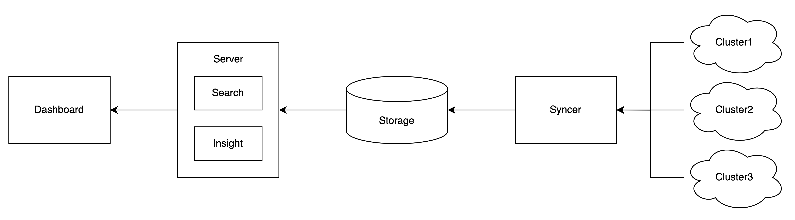

## Architecture

## Components

-   Dashboard: Web UI for Karpor.
-   Server: Main Backend Server for Karpor.
-   Syncer: Independent Server to synchronize cluster resources in real-time.
-   Storage: Storage Backend to store the synchronized resources and user data.

## How Karpor Works

1. After installation, users can register clusters of interest into Karpor.
2. The Syncer runs and automatically synchronizes the resources of interest from the cluster to Storage. It also ensures the real-time changes to the resources are automatically sync-ed to Karpor Storage.
3. When a user wishes to locate specific resource(s), a search query can be typed into the search box in the Dashboard. The Dashboard interacts with the search endpoint of the Server. The search module within the Server parses the search query, searches for relevant resources in Storage, and returns the results to the Dashboard.
4. Upon clicking a search result, the user is directed to a resource insight page. The Dashboard calls the insight endpoint of the Server, where the Server's insight module performs a static scan of the resource, generates issue reports, and locates its relevant resources to draw a resource topology map with all of its parents and children.
5. The insight page also applies to groups of resources, such as all resources in a cluster, a Group-Version-Kind combination, a namespace or a custom-defined resource group.

## Next Step
- Learn Karpor's [Glossary](../concepts/glossary).
- View [User Guide](../user-guide/multi-cluster-management) to look on more of what you can achieve with Karpor.

