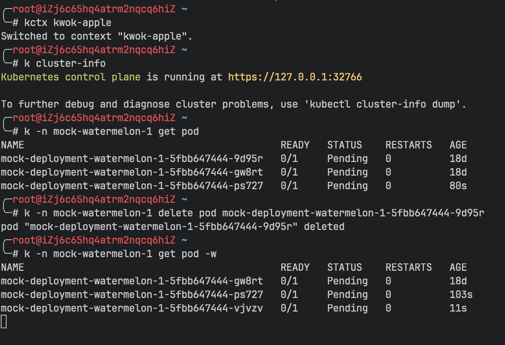

## Challenges and Demands

### The Scale of Multicluster at a Grand Scale

In June 2014, Kubernetes, born from Google's internal Borg project, made a striking debut. Endorsed by tech giants and aided by a thriving open-source community, it gradually became the de facto standard in the container orchestration field. As companies began to deploy Kubernetes in production environments, a single Kubernetes cluster could no longer meet the increasingly complex demands internally. It's common for the number of nodes in a single cluster to exceed the community-recommended limit (5,000), making the expansion into a multicluster configuration a natural choice.

### The Basic Needs from Multicluster Accessors

With the thriving development of multiclusters, various platforms may need to access resources across different clusters, requiring access to each cluster's KubeConfig.

As the number of users and clusters increases, cluster administrators face significant time costs: If there are `M` clusters and `N` users, the time complexity for managing KubeConfig becomes `O(M*N)`. Moreover, users need to switch between different KubeConfigs when accessing different clusters, and the corresponding permissions for KubeConfigs vary across clusters, undoubtedly adding to the complexity of use.

Under these circumstances, is there a method to conveniently access resources in different clusters without maintaining a large number of KubeConfigs and managing various users' permissions across clusters? Moreover, this method should ideally be cloud-native, accessible through kubectl and Kubernetes' official client, to reduce the cost of transitioning to this method. The emergence of `Karpor` is to solve these problems.

## The Idea of A "One-Pass Access"

We developed `Karpor`, an open-source project. While serving as a Kubernetes Explorer with unique advantages in searching and insight into cluster resources, its foundational multicluster management component, featuring cluster certificate issuance and multicluster request proxying, makes it highly suitable as a unified access point for platforms to multiple clusters. This component supports forwarding user requests to designated clusters in a cloud-native manner, allowing users to maintain a single set of KubeConfigs to access different clusters, making multicluster access as simple as accessing a single cluster. So, how does it work? Below, we introduce `Karpor`'s architecture and functionality.

### Multi-cluster Request Routing and Proxy

`Karpor` includes an application layer gateway capable of forwarding any Kubernetes-style request to a specified Kubernetes cluster. `Karpor` is also developed based on the Kubernetes framework as a kube-apiserver, which can operate independently or as an extension to an existing kube-apiserver. `Karpor` supports handling two types of extended resources: `Cluster` and `Cluster/Proxy`, the former for storing cluster information and the latter for forwarding user requests to a specific cluster. Users can access through the Kubernetes official CLI (`kubectl`) or SDK (`client-go`, `client-java`, etc.).

`Karpor` proxies all access to `Cluster/Proxy` subresources to the target cluster. For example, to retrieve Pod information from the `Cluster1` cluster, users need to send the `GET /apis/kusionstack.io/Cluster/cluster1/proxy/api/v1/pods` request to `Karpor`. `Karpor` will generate a KubeConfig from the `Cluster/Cluster1` resource for accessing the cluster and proxy the `/api/v1/pods` request to the `Cluster1` cluster.

### Supporting All Kubernetes Native Requests

`Karpor` supports forwarding all kube-apiserver requests. Specifically, `Karpor` is an application layer gateway that proxies HTTP requests through the HTTP connect protocol. In addition to supporting `get`, `create`, `update`, and `delete` operations on resources, it also supports `watch`, `log`, `exec`, `attach`, etc. (Since the SPDY protocol used for `exec`, and `attach` does not support http2, `Karpor` will disable http2 when forwarding these requests, switching to http1.1 and supporting hijacker processing).

## Summary

As can be gleaned from the text above, utilizing `Karpor`'s multi-cluster management component enables the issuance of a "multi-cluster pass" with controllable permissions for users. Users no longer need to concern themselves with issues such as frequent cluster certificate switching and onboarding of new clusters. With this "one-pass access", the cost of accessing multiple clusters is reduced, fulfilling the most fundamental needs of most users on multi-cluster platforms.
