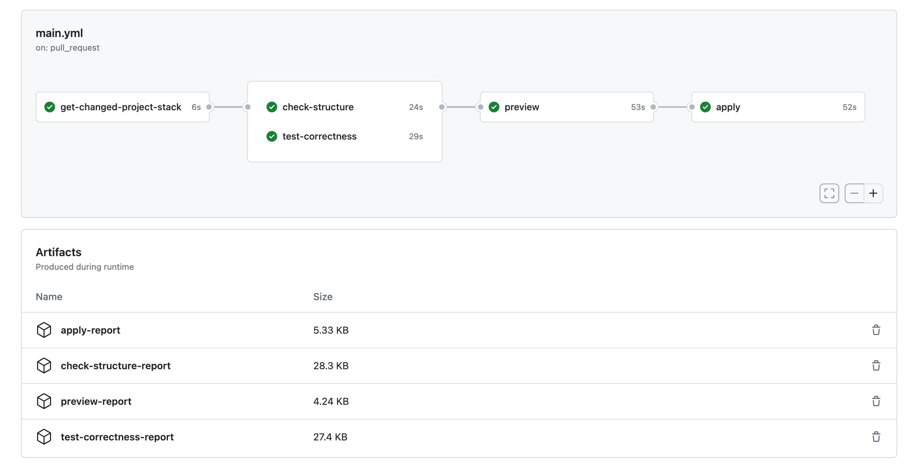
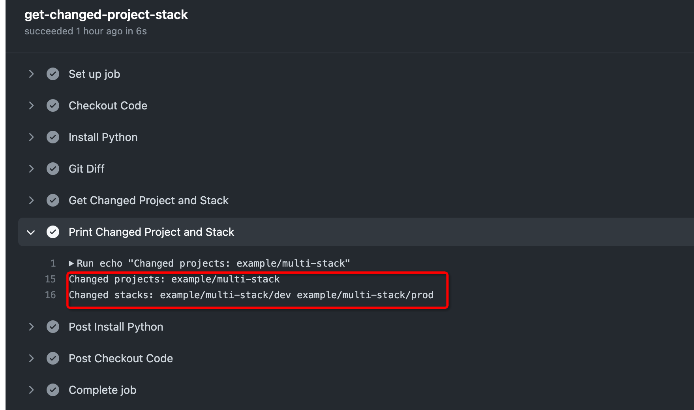
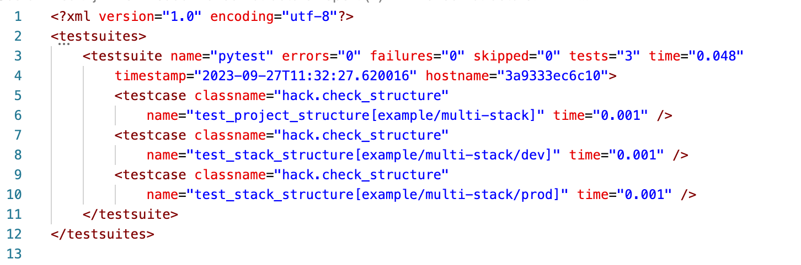
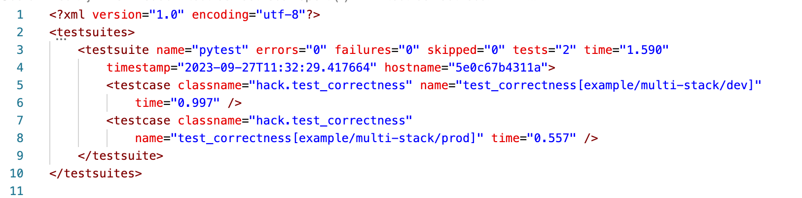
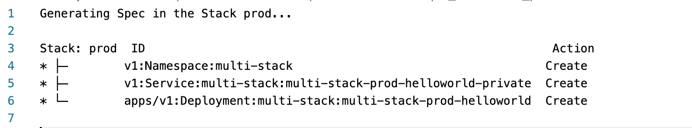
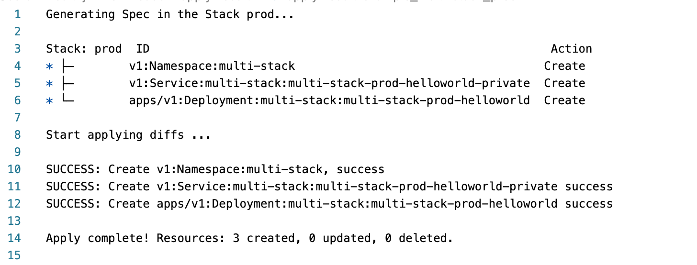

# Deploy Application Securely and Efficiently via GitHub Actions

This document provides the instruction to deploy your application securely and efficiently via GitHub Actions.

Using git repository is a very reliable and common way to manage code, and the same goes for Kusion-managed configuration code. [GitHub Actions](https://docs.github.com/en/actions) is a CI/CD platform. By customizing [GitHub Actions workflow](https://docs.github.com/en/actions/using-workflows/about-workflows), the pipeline such as building, testing, and deploying will be executed automatically.

Kusion has a commendable integration with Github Actions. You can use Github Actions to test configuration correctness, preview change, and deploy application. This tutorial demonstrates how to deploy and operate an application through GitHub Actions.

## GitHub Actions Workflow

[KusionStack/konfig](https://github.com/KusionStack/konfig) is the official example repository, and provides the GitHub Actions workflow [main.yml](https://github.com/KusionStack/konfig/blob/main/.github/workflows/main.yml). The main.yml is triggered by a push or a pull request on the main branch, and includes multiple jobs, which ensures the reliability of configuration code, and deploys the changed application.

The workflow to deploy an application is shown above, which includes the following jobs:

- Get changed project and stack
- Check project and stack structure
- Test code correctness
- Preview changed stack
- Apply changed stack

These jobs ensure the security and efficiency of the application deployment. Next, this tutorial will introduce the usage and function of these jobs. To show how they work more visually, *[updating port configuration of multi-stack](https://github.com/KusionStack/konfig/actions/runs/6325390734) (referred to "the example" in the below)* is given as an example.

## Get Changed Project and Stack

As Kusion organizes code by **project** and **stack**, to deploy the affected applications, analyze the changed project and stack is the first step.

The jobs, [get-changed-project-stack](https://github.com/KusionStack/konfig/blob/main/.github/workflows/main.yml#L10) perfectly accomplish the analysis. The main steps are as follows:

- Obtain the list of changed files through `git diff`;
- Based on the changed file list, obtain the changed projects and stacks which are indicated by `project.yaml` and `stack.yaml` respectively.

The [example](https://github.com/KusionStack/konfig/actions/runs/6325320773/job/17176584497) changes the file `example/multi-stack/base/base.k`, where the affected project is `example/multi-stack`, and the stack is `example/multi-stack/dev` and `example/multi-stack/prod`. Delightfully, the result, which is shown below, meets our expectation.

## Check Project and Stack Structure

The job [check-structure](https://github.com/KusionStack/konfig/blob/main/.github/workflows/main.yml#L39) guarantees the structure legality of the changed project and stack, so that Kusion CLI tools can be used correctly. The check items are as follows:

- The field `name` is required in project.yaml;
- The field `name` is required in stack.yaml.

The success of structure-check means the correctness of structure. A [pytest](https://docs.pytest.org/en/7.3.x/) report `check-structure-report` is also generated, and you can get it from [GithHub Actions Artifacts](https://docs.github.com/en/actions/managing-workflow-runs/downloading-workflow-artifacts) .

The [example](https://github.com/KusionStack/konfig/actions/runs/6325320773/job/17176592318) passes the directory structure verification. It is clear from the report that the changed project and stack have get checked, and the result is passed.

## Test Code Correctness

Besides a rightful structure, the code must have correct syntax and semantics, and the job [test-correctness](https://github.com/KusionStack/konfig/blob/main/.github/workflows/main.yml#L65) ensures the correctness. `kusion compile` get executed on the changed stacks. If succeeded, there are no syntax errors; or the configuration code is illegal, and the following application deployment will fail.

The report whose name is `test-correctness-report` get generated.

The [example](https://github.com/KusionStack/konfig/actions/runs/6325320773/job/17176592034) passes the code correctness test. The report shows that the tested stack is `example/multi-stack/dev` and `example/multi-stack/prod`, and the result is passed.

## Preview Changed Stack

After passing the above jobs, security of the configuration change is guaranteed, and it's time to deploy your application. Before applying the change to the real infrastructure, it's necessary to get the expected result of the application deployment. The job [preview](https://github.com/KusionStack/konfig/blob/main/.github/workflows/main.yml#L90) calls `kusion preview` to get the expected change result, the result is uploaded to the artifact `preview-report`. If the result meets your requirement, you can go to the next job and deploy the application.

The [example](https://github.com/KusionStack/konfig/actions/runs/6325320773/job/17176612053) changes stack `example/multi-stack/dev` and `example/multi-stack/prod`. The following picture shows the preview result of `example/multi-stack/prod`, where the result is to create a Kubernetes Namespace, Service and Deployment if call `kusion apply`.
 

## Apply Changed Stack
Finally, the last step is arrived, i.e. deploy application. The job [apply](https://github.com/KusionStack/konfig/blob/main/.github/workflows/main.yml#L121) calls `kusion apply` to apply the configuration change to the real infrastructure. If the job succeeded, the result will be uploaded to the artifact `apply-report`.

For the stack `example/multi-stack/prod` in the [example](https://github.com/KusionStack/konfig/actions/runs/6325320773/job/17176645252), a Kubernetes Namespace, Service and Deployment get created, which is consistent with the preview result.

## Summary
This tutorial demonstrates how Kusion integrates with GitHub Actions to deploy an application. By structure check, correctness test, preview and apply, Kusion with GitHub Actions enables you deploy application efficiently and securely.
