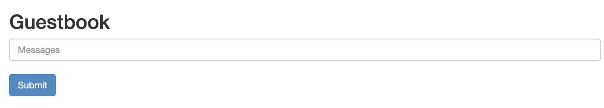

# Deploy Application

This guide shows you how to use Kusion CLIs to complete the deployment of an application running in Kubernetes.
We call the abstraction of application operation and maintenance configuration as `AppConfiguration`, and its instance as `Application`.
It is essentially an configuration model that describes an application. The complete definition can be seen [here](/docs/user_docs/reference/model/catalog_models/doc_app_configuration.md).

In production, the application generally includes minimally several k8s resources:

- Namespace
- Deployment
- Service

:::tip

This guide requires you to have a basic understanding of Kubernetes.
If you are not familiar with the relevant concepts, please refer to the links below:

- [Learn Kubernetes Basics](https://kubernetes.io/docs/tutorials/kubernetes-basics/)
- [Namespace](https://kubernetes.io/docs/concepts/overview/working-with-objects/namespaces/)
- [Deployment](https://kubernetes.io/docs/concepts/workloads/controllers/deployment/)
- [Service](https://kubernetes.io/docs/concepts/services-networking/service/)
:::

## Prerequisites

Before we start, we need to complete the following steps:

1、Install Kusion

We recommend using HomeBrew(Mac), Scoop(Windows), or an installation shell script to download and install Kusion.
See [Download and Install](/docs/user_docs/getting-started/install) for more details.

2、Running Kubernetes cluster

There must be a running Kubernetes cluster and a [kubectl](https://Kubernetes.io/docs/tasks/tools/#kubectl) command line tool.
If you don't have a cluster yet, you can use [Minikube](https://minikube.sigs.k8s.io/docs/tutorials/multi_node/) to start one of your own.

## Initializing

This guide is to deploy an app using Kusion, relying on the Kusion CLI and a Kubernetes cluster.

To initialize the application configuration:

```bash
kusion init
```

The `kusion init` command will prompt you to enter required parameters, such as project name, project description, image address, etc.
You can keep pressing _Enter_ all the way to use the default values.

The output is similar to:

```
✔ single-stack-sample    A minimal kusion project of single stack
This command will walk you through creating a new kusion project.

Enter a value or leave blank to accept the (default), and press <ENTER>.
Press ^C at any time to quit.

Project Config:
✔ Project Name: helloworld
✔ AppName: helloworld
✔ ProjectName: helloworld
Stack Config: dev
✔ Image: gcr.io/google-samples/gb-frontend:v4

Created project 'helloworld'
```

Now, we have successfully initialized a project `helloworld` using the `single-stack-sample` template, which contains a `dev` stack. 

- `AppName` represents the name of the sample application, which is recorded in the generated `main.k` as the name of the `AppConfiguration` instance.
- `ProjectName` and `Project Name` represent the name of the sample project, which is used as the generated folder name and then recorded in the generated `project.yaml`.
- `Image` represents the image address of the application container.

:::info

See [Project&Stack](/user_docs/concepts/glossary.md) for more details about Project and Stack.
:::

The directory structure is as follows:

```
helloworld
  ├── README.md
  ├── dev
  │   ├── main.k
  │   ├── kcl.mod
  │   ├── kcl.mod.lock
  │   └── stack.yaml
  └── project.yaml

1 directory, 6 files
```

The project directory has the following files that are automatically generated:
- `README.md` contains the generated README from a template.
- `project.yaml` represents project-level configurations.
- `dev` directory stores the customized stack configuration:
  - `dev/main.k` stores configurations in the `dev` stack.
  - `dev/stack.yaml` stores stack-level configurations.
  - `dev/kcl.mod` stores stack-level dependencies.
  - `dev/kcl.mod.lock` stores version-sensitive dependencies.

In general, the `.k` files are the KCL source code that represents the application configuration, and the `.yaml` is the static configuration file that describes behavior at the project or stack level.

### kcl.mod
There should be a `kcl.mod` file generated automatically under the project directory. The `kcl.mod` file describes the dependency for the current project or stack. By default, it should contain a reference to the official [`catalog` repository](https://github.com/KusionStack/catalog) which holds some common model definitions that fits best practices. You can also create your own models library and reference that.

## Compiling

At this point, the project has been initialized with the Kusion built-in template.
The configuration is written in KCL, not JSON/YAML which Kubernetes recognizes, so it needs to be compiled to get the final output.

Enter stack dir `helloworld/dev` and compile:

```bash
cd helloworld/dev && kusion compile
```

The output is printed to `stdout` by default. You can save it to a file using the `-o/--output` flag when running `kusion compile`.

The output of `kusion compile` is the spec format.

:::tip

For instructions on the kusion command line tool, execute `kusion -h`, or refer to the tool's online [documentation](/docs/user_docs/reference/cli/kusion/index)。
:::

## Applying

Compilation is now completed. We can apply the configuration as the next step. In the output from `kusion compile`, you can see 3 resources:

- a Namespace named `helloworld`
- a Deployment named `helloworld-dev-helloworld` in the `helloworld` namespace
- a Service named `helloworld-dev-helloworld-private` in the `helloworld` namespace

Execute command:

```bash
kusion apply
```

The output is similar to:

```
 ✔︎  Generating Spec in the Stack dev...                                                                                                                                                                                                                                         
Stack: dev  ID                                                       Action
* ├─     v1:Namespace:helloworld                                  Create
* ├─     v1:Service:helloworld:helloworld-dev-helloworld-private  Create
* └─     apps/v1:Deployment:helloworld:helloworld-dev-helloworld  Create


? Do you want to apply these diffs? yes
Start applying diffs ...
 SUCCESS  Create v1:Namespace:helloworld success                                                                                                                                                                                                                                
 SUCCESS  Create v1:Service:helloworld:helloworld-dev-helloworld-private success                                                                                                                                                                                                
 SUCCESS  Create apps/v1:Deployment:helloworld:helloworld-dev-helloworld success                                                                                                                                                                                                
Create apps/v1:Deployment:helloworld:helloworld-dev-helloworld success [3/3] █████████████████████████████████████████████████████████████████████████████████████████████████████████████████████████████████████████████████████████████████████████████████████████ 100% | 0s
Apply complete! Resources: 3 created, 0 updated, 0 deleted.
```

After the configuration applying successfully, you can use the `kubectl` to check the actual status of these resources.

1、 Check Namespace

```bash
kubectl get ns
```

The output is similar to:

```
NAME                   STATUS   AGE
default                Active   117d
helloworld             Active   63s
kube-system            Active   117d
...
```

2、Check Deployment

```bash
kubectl get deploy -n helloworld
```

The output is similar to:

```
NAME                        READY   UP-TO-DATE   AVAILABLE   AGE
helloworld-dev-helloworld   2/2     2            2           111s
```

3、Check Service

```bash
kubectl get svc -n helloworld
```

The output is similar to:

```
NAME                                TYPE        CLUSTER-IP     EXTERNAL-IP   PORT(S)    AGE
helloworld-dev-helloworld-private   ClusterIP   10.111.183.0   <none>        80/TCP   2m6s
```

4、Validate app

Using the `kubectl` tool, forward native port `30000` to the service port `80`.

```bash
kubectl port-forward svc/helloworld-dev-helloworld-private -n helloworld 30000:80
```

Open browser and visit [http://127.0.0.1:30000](http://127.0.0.1:30000)：


