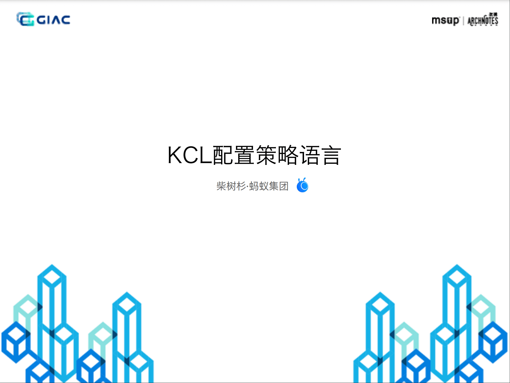

Introduce the background of the birth of KCL cloud native configuration language in Ant, language features, practical exploration and future development thinking.

- Introduction: https://giac.msup.com.cn/course?id=15307
- Lecture Notes: https://segmentfault.com/a/1190000040455559
- [Download PDF](https://gw.alipayobjects.com/os/bmw-prod/2cb0c283-5f24-485e-b635-b6efac887eba.pdf)

