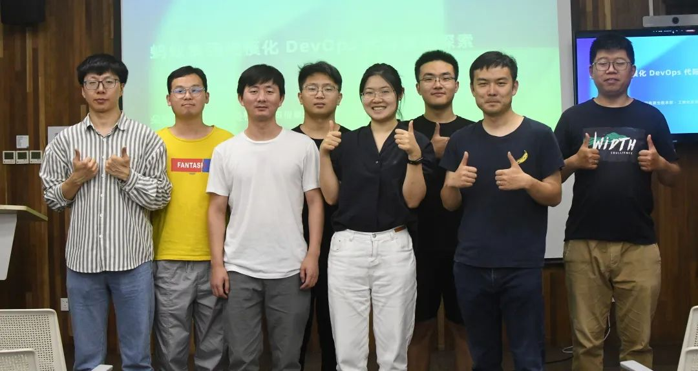
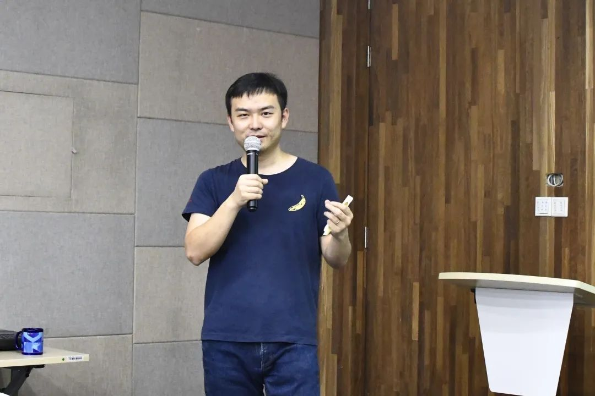
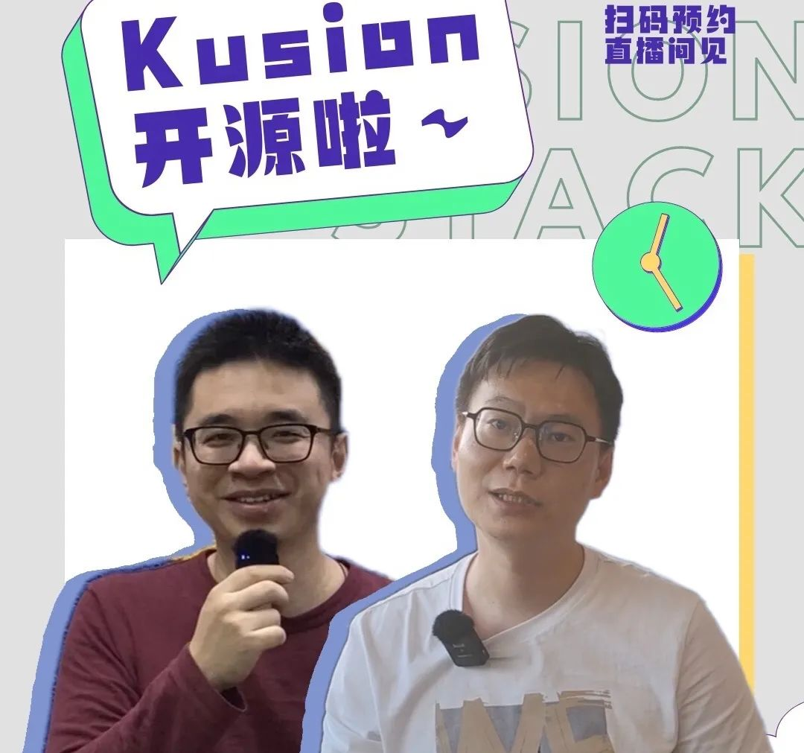
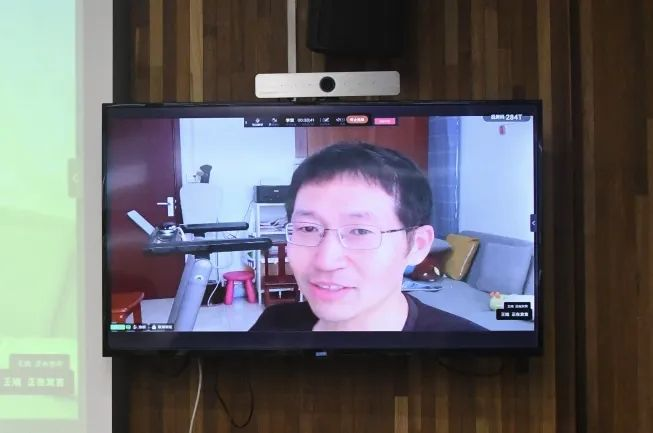
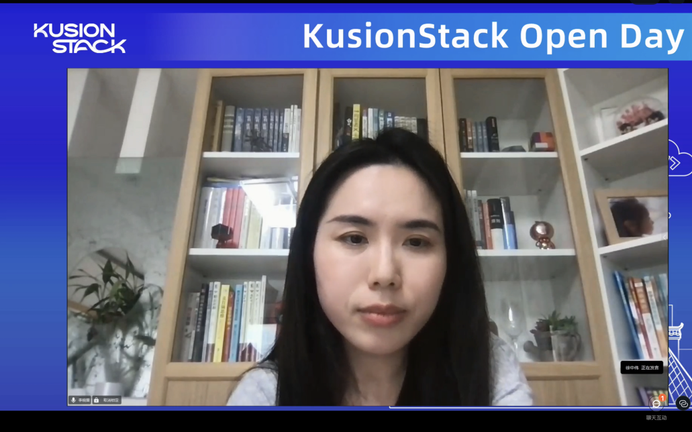
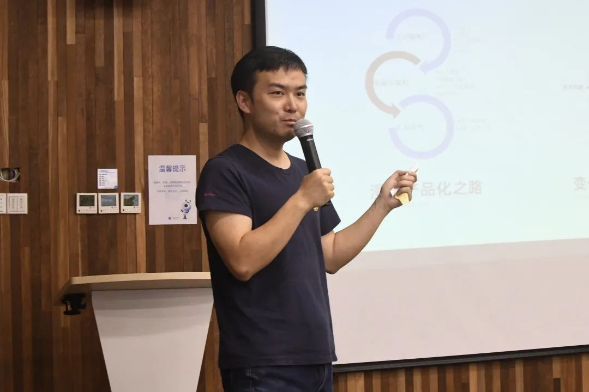
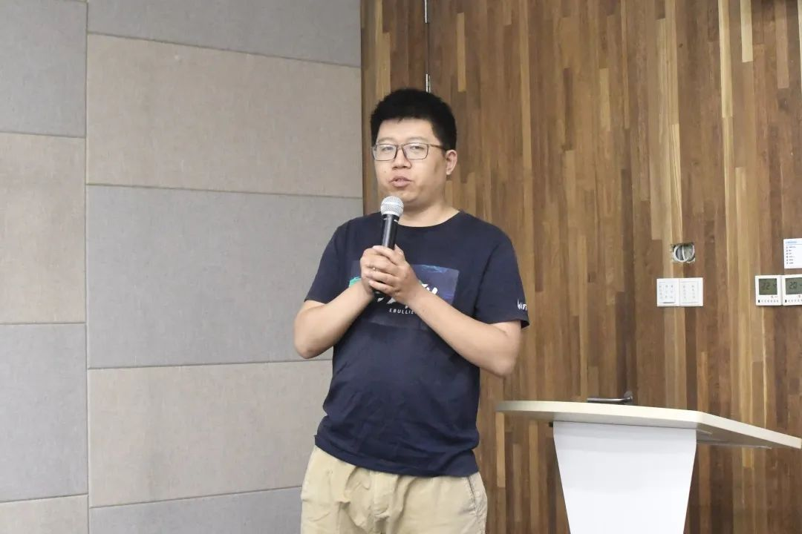
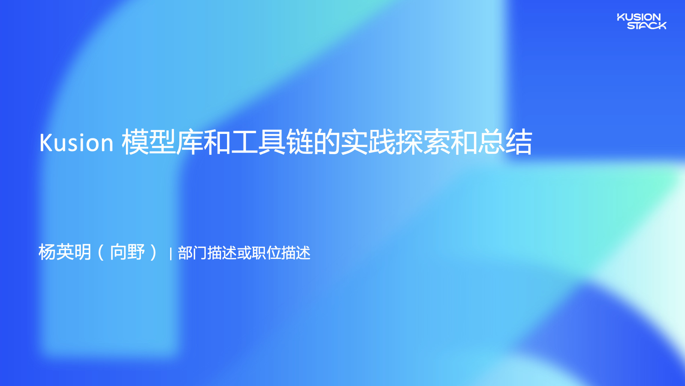
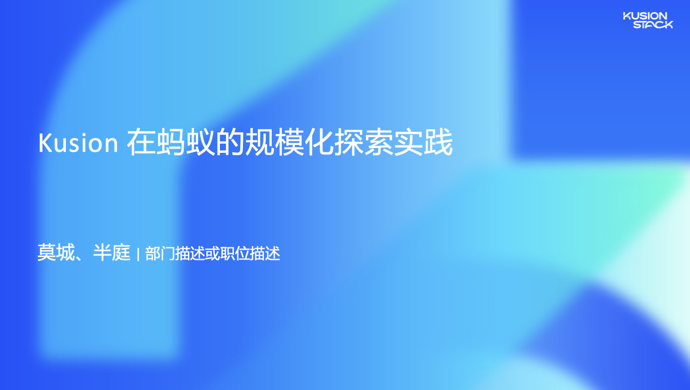

2022 年 5 月 28 日，KusionStack Open Day 线上线下视频直播正式宣布 KusionStack 一站式可编程配置技术栈（包含 KCL 配置语言、Kusion 引擎、Konfig 配置大库）开源。

以上是 KusionStack 杭州团队合影。至此，🎉KusionStack Open Day 圆满结束🎉

## 1. 精彩瞬间

感谢大家抽空参加，我们一起来回顾下👀，本次活动的精彩瞬间吧～👏

蚂蚁集团高级技术专家、Kusion 项目发起人及负责人——朵晓东作为整场活动的主持人，带领大家一起回顾了 Kusion 项目演进历程，并宣布了 KusionStack 正式开源的好消息！

活动开场，Kusion 项目的两位 Sponsor——蚂蚁集团可信原生技术部负责人何征宇和技术风险部负责人陈亮，对 Kusion 从研发至今的发展回顾和未来展望。两位 Sponsor 在视频中给予了 Kusion 项目极大的认可，并为 KusionStack 的开源献上了祝福。

Kata 创始人、木兰社区 TOC —— 王旭

王旭在会上也表达了对 KusionStack 开源的喜悦。他指出：一个项目拿出来开源的好的时机，应当是项目还处在未完全成熟的阶段，这样在开源出来之后，才能够通过开源社区的开发者们，一起推动项目更好的发展，开源不是为了秀肌肉。

在最后，他再次为 KusionStack 的开源送上了诚挚的祝福。

接下来是各位嘉宾的精彩分享，一起来回顾一下吧～

## 2. 《数字化出海业务的 DevOps 探索和实践》

开场演讲的众安国际科技 Engineering 负责人李晓蕾（Sherry Lee），介绍了众安国际 DevOps 在支持数字化出海业务过程遇到难点和对应的解决之道。

她从数字化出海对 DevOps 带来的挑战、众安国际 DevOps 遇到的难点和解决方案以及 DevOps 具体实践案例分享三个方面展开了宝贵的经验分享。

- PDF: [数字化出海业务的DevOps探索和实践](https://github.com/KusionStack/community/blob/main/2022/open-day/0-Sherry-Lee-数字化出海业务的DevOps探索和实践.pdf)
- Video(Bilibili): https://www.bilibili.com/video/BV1hr4y1x72a
- Video(YouTube): https://www.youtube.com/watch?v=tYDw__lBcYM

## 3. 《蚂蚁集团规模化 DevOps 的代际演进探索》

蚂蚁集团高级技术专家、Kusion 项目发起人及负责人——朵晓东分享了 Kusion 的项目背景和发展进程，同时他宣布 Kusion 正式开源，并分享了开源计划。

目前，基于 Kusion 的新一代 PaaS 体系已逐步应用在蚂蚁众多内外部场景，在多种运维场景覆盖、规模化协同效率提升、多主体/站点交付运维、技术创新运维效率提升等多方面体系出显著的优势和价值。

- PDF: [蚂蚁集团规模化 DevOps 代际演进探索](https://github.com/KusionStack/community/blob/main/2022/open-day/1-朵晓东-蚂蚁集团规模化DevOps代际演进探索.pdf)
- Video(Bilibili): https://www.bilibili.com/video/BV1WZ4y147pC
- Video(YouTube): https://www.youtube.com/watch?v=T6NKkb1L1eM

## 4. 《KCL 配置策略语言》

蚂蚁集团高级研发工程师徐鹏飞介绍了 KCL 的相关核心特性，分享了 KCL 技术栈的思路、架构、关键技术，并展开讲述了 KCL 的在蚂蚁内部多场景的实践经历。

KCL 帮助不同角色的用户以简单、可扩展、稳定、高效、分而治之的方式完成开发和运维任务，同时支持与自动化系统集成，实现极致的执行效率。

- PDF: [KCL配置策略语言](https://github.com/KusionStack/community/blob/main/2022/open-day/2-徐鹏飞-KCL配置策略语言.pdf)
- Video(Bilibili): https://www.bilibili.com/video/BV1bv4y1w7ke
- Video(YouTube): https://www.youtube.com/watch?v=mUFFri_eRAQ

## 5. 中场休息

中场休息期间，“开源老兵”、Go 语言大佬——柴树杉老师浅谈了他参与 KusionStack 的心路历程和个人收获，并表达了能有更多伙伴参与到 KusionStack 的开源共建的希望。

## 6. 《Kusion 模型库和工具链的实践探索和总结》

蚂蚁集团高级研发工程师杨英明以实际的案例介绍了如何通过 KCL 抽象 Kusion 模型库，以及如何结合 Kusion 工具链一站式的完成配置代码的编写和生效，同时总结分享了通过这套模式进行实际交付的经验和建议。

- PDF: [Kusion模型库和工具链的实践探索和总结](https://github.com/KusionStack/community/blob/main/2022/open-day/3-杨英明-Kusion模型库和工具链的实践探索和总结.pdf)
- Video(Bilibili): https://www.bilibili.com/video/BV1Vr4y1x7Ty
- Video(YouTube): https://www.youtube.com/watch?v=HDUm_KrunLY

## 7. 《Kusion 在蚂蚁的规模化实践》

最后，蚂蚁集团技术专家史贵明和蚂蚁集团高级运维工程师李治玮共同带来了 Kusion 在蚂蚁的规模化实践的分享。史贵明主要从 PaaS 配置管理的系统架构角度讲述了蚂蚁目前的多云配置管理能力，李治玮则从 SRE 视角下，分享了使用 KCL 解决多种复杂基础设施的交付效率问题和价值。

- PDF: [Kusion在蚂蚁的规模化探索实践](https://github.com/KusionStack/community/blob/main/2022/open-day/4-莫城-半庭-Kusion在蚂蚁的规模化探索实践.pdf)
- Video(Bilibili): https://www.bilibili.com/video/BV1xB4y1X7sv
- Video(YouTube): https://www.youtube.com/watch?v=F9lZEU5GNYE

## 8. 未来展望

开源并不代表 KusionStack 已经完成，相反我们还有很多需要完善和改进的地方，同时开源社区和文化也对文档和代码提出了更高的要求。这只是一个开始，希望更多从事相关领域的同学能够参与共建，为国内的云原生、DSL 等新兴领域贡献力量。

最后，感谢大家的参与🙏
