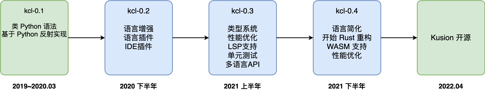
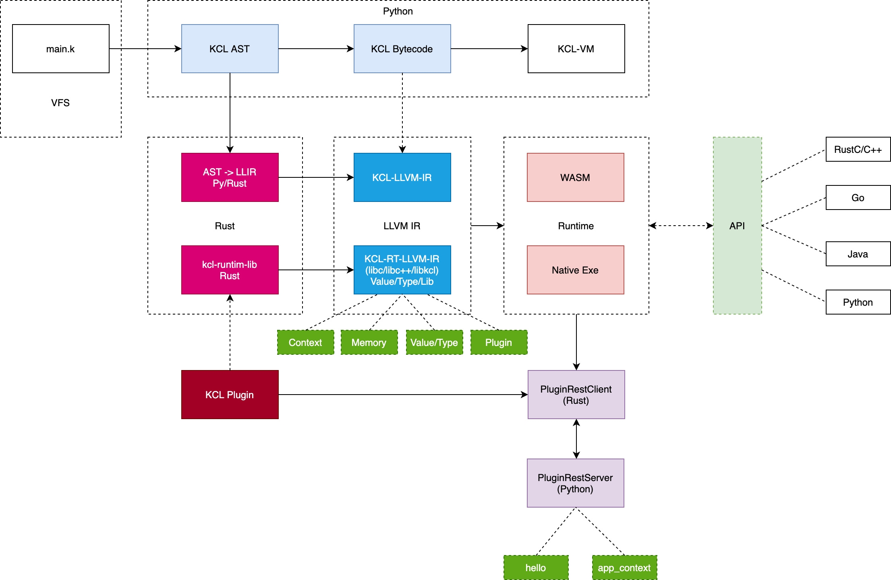

# KCLVM Architecture

## 1. 演化历史

KCLVM 是 KCL 配置语言的实现。KCL 语言从 2019 年开始初期的调研和设计工作。到 2020 年 3 月发布 kcl-0.1，基于Python定制语法，采用 Python 反射方式工作。2020 年下半年改用 Python 语言并加快了开发和迭代速度，发布的 kcl-0.2.x 引入了大量语言特性、增加了 Plugin 扩展支持、同时支持 IDEA 插件。2021 年上半年开始统一优化和整合语言特性，发布的 kcl-0.3 优化类型系统、集成单元测试工具、优化执行性能并提供了 Go 等多语言的 API 支持、同时通过 LSP 为 VSCode 提供支持。2021 年下半年开始采用 Rust 语言进行渐进式重构，同时引入静态类型检查和优化性能，完善语言的文档支持。

## 2. 最新架构

2021 年开始用 Rust 重构后的 KCLVM 架构图如下图所示（预计在 2022.05 完成重构）：

由于历史原因，架构中 AST 的解析和字节码版本的执行目前依然是采用 Python 实现。基于 Rust 重构的工作从后端开始向前端逐步进行，前期借助 Python 产出的 AST 和类型检查等特性，然后通过 Rust 实现后端 LLVM-IR 的输出，最终完成后核心功能将全部用 Rust 实现。

KCLVM 编译器整体为三段式架构，并在其中借助了 LLVM-IR 作为 KCL 连接 Native/WASM 代码的中间纽带，主要有以下 3 个核心工作：

* KCL AST 到 LLVM-IR 的翻译：通过遍历 KCL AST，根据 KCL 语言规范生成相应的 LLVM-IR 代码，相当于用户态代码。
* KCL Runtime Lib：运行时辅助函数库，提供运行时 KCL 的值/类型计算、内存、上下文管理、内置库和插件库支持，相当于系统态代码。
* 用户态与系统态代码链接与执行：将用户态代码与系统态代码链接为一个动态链接库/WASM Module，最终通过统一的 Runner 模块执行编译后的 KCL 代码。

## 3. 展望

希望能够将 KCLVM 的中通用的开发经验提炼为 DSL 语言实现的编程框架，同时能够支持更多的后端、集成更多的社区生态。
