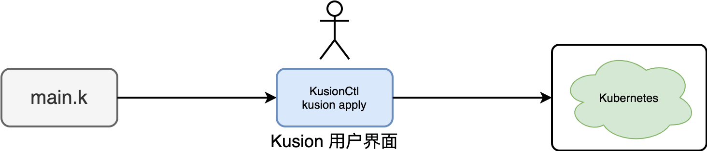
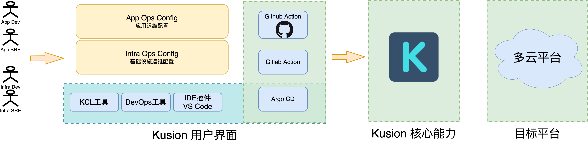

# User Interface

## 1. 单 App 应用界面

Kusion 用户界面并不是仅仅指传统的网页控制台界面，它是用户在使用 Kusion 过程中直接感知的能力和功能界面。最简单的 Kusion 用户界面就是 [KusionCtl](/docs/user_docs/support/faq-concepts#5-kusionctl) 命令行工具。

以上只是针对单 App 应用这种简单场景的关系图，用户只面对一个 Kusion 命令行工具。

## 2. 规模化 App 应用界面

Kusion 最初是针对规模化 App 应用运维而开发的可编程配置技术栈。为了开发效率，Kusion 同时为 kusionctl 命令行提供了配套和的提效工具：KCL 命令、DevOps 工具、IDE 插件等。此外为了和开发系统集成，Kusion 同时也可针对 Github Action、Gitlab Action 和 ArgoCD 等系统配置对应的能力。因此更详细的 Kusion 用户界面如下图所示：

现在 Kusion 用户界面对应其中向左倒下的大写 L 形状的界面，包含本地工具和各种 CICD 集成的界面等。

## 3. 不同角色和场景组合

在规模化运维中，经常需要涉及 App 和基础设施两个不同的应用场景，同时涉及开发者和 SRE 两种不同的角色，两种角色和两种场景产生的多种组合。不同角色的用户针对不同的场景分别开发 App Ops Config 和 Infra Ops Config，并统一到 Konfig 大库中进行开发和版本管理。这些配置最终构成了规模化运维涉及到各种配置代码，它们通过 Kusion 用户界面开发、测试，并最终通过各种 CICD 系统自动化 Apply 到最终目标平台。

## 4. 本地工具和生态集成

KCL 命令行工具、DevOps 工具和 IDE 插件等本地工具用于提供原子的能力，同时方便本地开发工作。开发完成之后通过 Konfig 大库合并代码时触发各种 CICD 系统自动化 Apply 到最终目标平台。

