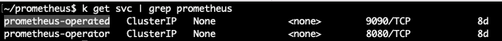
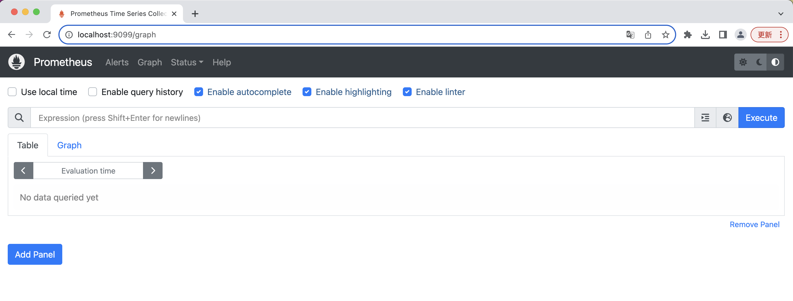
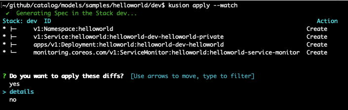
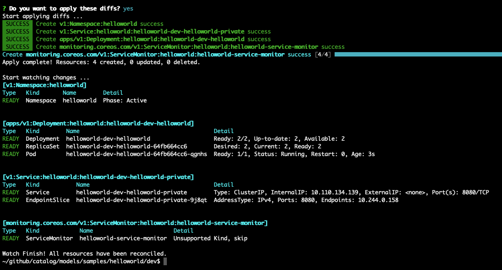
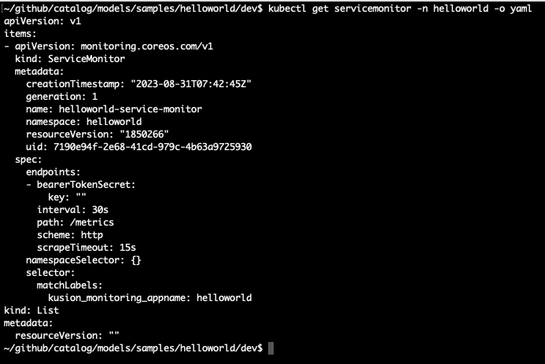
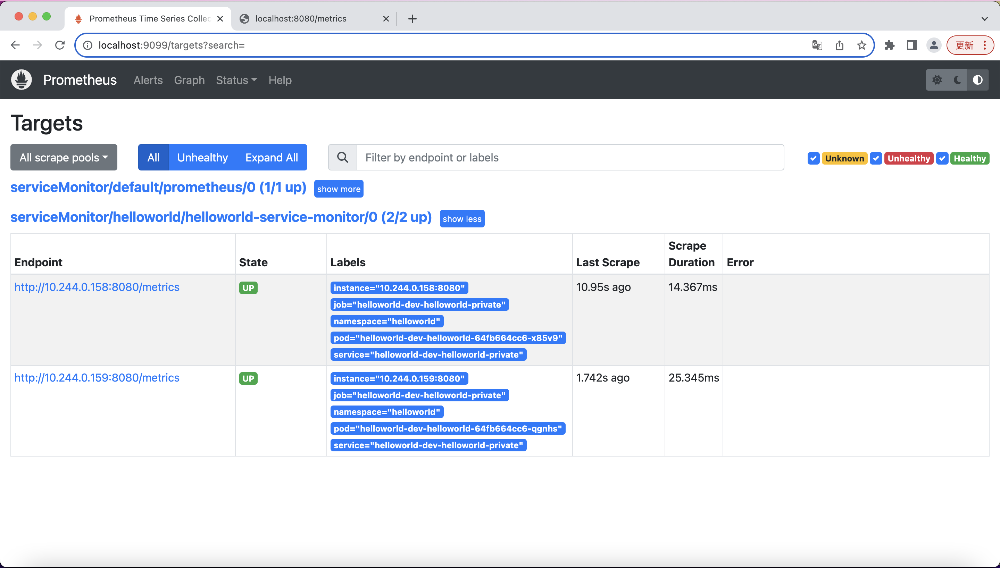
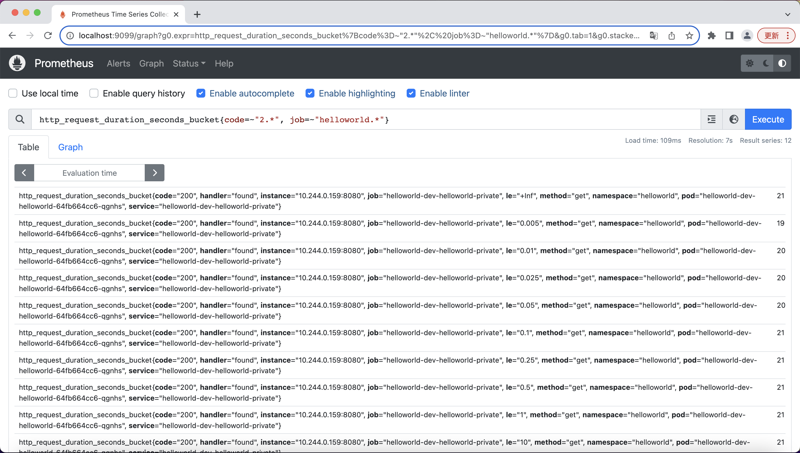

# 使用 Prometheus 配置监控

本篇指南向您展示，如何使用 Kusion命令行工具，管理基于 Prometheus 的应用监控配置。未来我们会添加更多与云服务商整合的监控方案，包括 AWS CloudWatch， Azure Monitor等。

本篇示例中包含了以下Kubernetes资源的创建：
- Namespace
- Deployment
- Service
- ServiceMonitor

:::tip

这篇指南假设您已熟悉Kubernetes的一些基本概念。如果不熟悉，可以前往 Kubernetes 和 Prometheus 官方网站，查看相关说明：

- [Learn Kubernetes Basics](https://kubernetes.io/docs/tutorials/kubernetes-basics/)
- [Prometheus Introduction](https://prometheus.io/docs/introduction/overview/)
:::

## 1. 准备工作

可参考：[部署应用服务/准备工作](../working-with-k8s/1-deploy-application.md#1-准备工作)

下文中案例需要您已经正确使用`kusion init`[初始化项目](../working-with-k8s/1-deploy-application.md#2-初始化)。初始化会自动生成一个`kcl.mod`文件位于当前的配置栈(Stack)下。

## 2. 准备 Prometheus 服务

Prometheus 可以以多种方式在集群内提供服务，包括：
1. 安装一个Prometheus operator在集群内
2. 安装一个Prometheus server在集群内
3. 安装一个Prometheus agent在集群内，连接到一个远端的Prometheus server

[Prometheus团队建议](https://github.com/prometheus-operator/prometheus-operator/issues/1547#issuecomment-401092041)通过 Prometheus operator 使用`ServiceMonitor` or `PodMonitor` 的 Kubernetes CR 来管理监控抓取的配置<sup>[2]</sup>。

无论使用哪种安装方式，Prometheus 服务每个集群只需要安装一次。本篇指南使用minikube集群和Prometheus operator为案例。

### 安装 Prometheus operator<sup>[3]</sup>.

要完成本篇中的案例，您只需要一个运行中的 Prometheus operator。您可以通过如下命令安装：
```
LATEST=$(curl -s https://api.github.com/repos/prometheus-operator/prometheus-operator/releases/latest | jq -cr .tag_name)
curl -sL https://github.com/prometheus-operator/prometheus-operator/releases/download/${LATEST}/bundle.yaml | kubectl create -f -
```

以上命令会在默认命名空间中安装所有需要的 Kubernetes CRD 和 Prometheus operator。几分钟之内，您可以通过以下命令确认 Prometheus operator 正在运行：
```
kubectl wait --for=condition=Ready pods -l  app.kubernetes.io/name=prometheus-operator -n default
```

### 确认 RBAC 设置正确
如果在集群中启用了 RBAC，如下 RBAC 资源需要被正确创建：
```
apiVersion: v1
kind: ServiceAccount
metadata:
  name: prometheus
---
apiVersion: rbac.authorization.k8s.io/v1
kind: ClusterRole
metadata:
  name: prometheus
rules:
- apiGroups: [""]
  resources:
  - nodes
  - nodes/metrics
  - services
  - endpoints
  - pods
  verbs: ["get", "list", "watch"]
- apiGroups: [""]
  resources:
  - configmaps
  verbs: ["get"]
- apiGroups:
  - networking.k8s.io
  resources:
  - ingresses
  verbs: ["get", "list", "watch"]
- nonResourceURLs: ["/metrics"]
  verbs: ["get"]
---
apiVersion: rbac.authorization.k8s.io/v1
kind: ClusterRoleBinding
metadata:
  name: prometheus
roleRef:
  apiGroup: rbac.authorization.k8s.io
  kind: ClusterRole
  name: prometheus
subjects:
- kind: ServiceAccount
  name: prometheus
  namespace: default
```

### 通过 operator 配置 Prometheus 实例
完成 RBAC 设置后，您可以通过 operator 监控的 Kubernetes CR 配置 Prometheus 实例：
```
apiVersion: monitoring.coreos.com/v1
kind: Prometheus
metadata:
  name: prometheus
spec:
  serviceAccountName: prometheus
  serviceMonitorNamespaceSelector: {}
  serviceMonitorSelector: {}
  podMonitorNamespaceSelector: {}
  podMonitorSelector: {}
  resources:
    requests:
      memory: 400Mi
```
以上 Prometheus 实例会覆盖整个集群内所有命名空间的所有`ServiceMonitor`和`PodMonitor`资源。

您可以按照集群的规模适当的增减 requests 和 limits。

### 暴露 Prometheus 界面 (可选)
当以上 Prometheus 实例被创建后，您应该可以看见一个名为`prometheus-operated`的服务被创建出来：


在minikube上, 您可以通过`kubectl`端口转发从本地访问这个 Prometheus 界面:
```
kubectl port-forward svc/prometheus-operated 9099:9090
``` 

您应当可以通过浏览器访问`localhost:9099`来访问 Prometheus 界面：


如果不在minikube上运行，您可以通过别的方式暴露 Prometheus 的界面，比如通过 Ingress Controller。

## 使用 kusion 部署包含监控配置的应用

到这一步时我们已经完成了集群层面需要的所有准备工作！任何之后通过 kusion 部署的应用都可以自动创建监控相关的资源，只要您在应用配置(AppConfiguration)中声明了需要通过 kusion 管理监控配置。

AppConfiguration中，监控配置是通过`monitoring`字段管理。下文会提供一个完整的，可部署的示例：

我们这里使用了一个新的提供了 Prometheus 监控数据的应用镜像 `quay.io/brancz/prometheus-example-app`:

`helloworld/dev/main.k`:
```
import catalog.models.schema.v1 as ac
import catalog.models.schema.v1.workload as wl
import catalog.models.schema.v1.workload.container as c
import catalog.models.schema.v1.monitoring as m
import catalog.models.schema.v1.workload.network as n

helloworld: ac.AppConfiguration {
    workload: wl.Service {
        containers: {
            "monitoring-sample-app": c.Container {
                image: "quay.io/brancz/prometheus-example-app:v0.3.0"
            }
        }
        ports: [
            n.Port {
                port: 8080
            }
        ]
    }
    monitoring: m.Prometheus{
        interval:       "30s"
        timeout:        "15s"
        path:           "/metrics"
        scheme:         "http"
    }
}
```

以上这份配置包含了一个 Service 类型的工作负载，对外暴露8080的端口，并且希望 Prometheus 每30秒抓取一个`/metrics`接口的监控数据。

执行`kusion apply`会创建一个`Namespace`，一个`Deployment`，一个`Service`和一个`ServiceMonitor`：


继续执行`kusion apply`:


我们可以通过`kubectl`验证`ServiceMonitor`被成功创建:


几秒中之内，我们可以通过 Prometheus 的前端界面看到我们刚刚部署的服务被 Prometheus 捕捉到并纳入监控了：


您可以通过一些简单的 query 查询 Prometheus 抓取的监控配置：


更多关于 PromQL 的信息, 可以在[这里](https://prometheus.io/docs/prometheus/latest/querying/basics/)<sup>[4]</sup> 查看。

## 引用
1. Prometheus 文档: https://prometheus.io/docs/introduction/overview/
2. Prometheus team 建议: https://github.com/prometheus-operator/prometheus-operator/issues/1547#issuecomment-446691500
3. Prometheus operator getting started 文档: https://github.com/prometheus-operator/prometheus-operator/blob/main/Documentation/user-guides/getting-started.md
4. PromQL 基础: https://prometheus.io/docs/prometheus/latest/querying/basics/