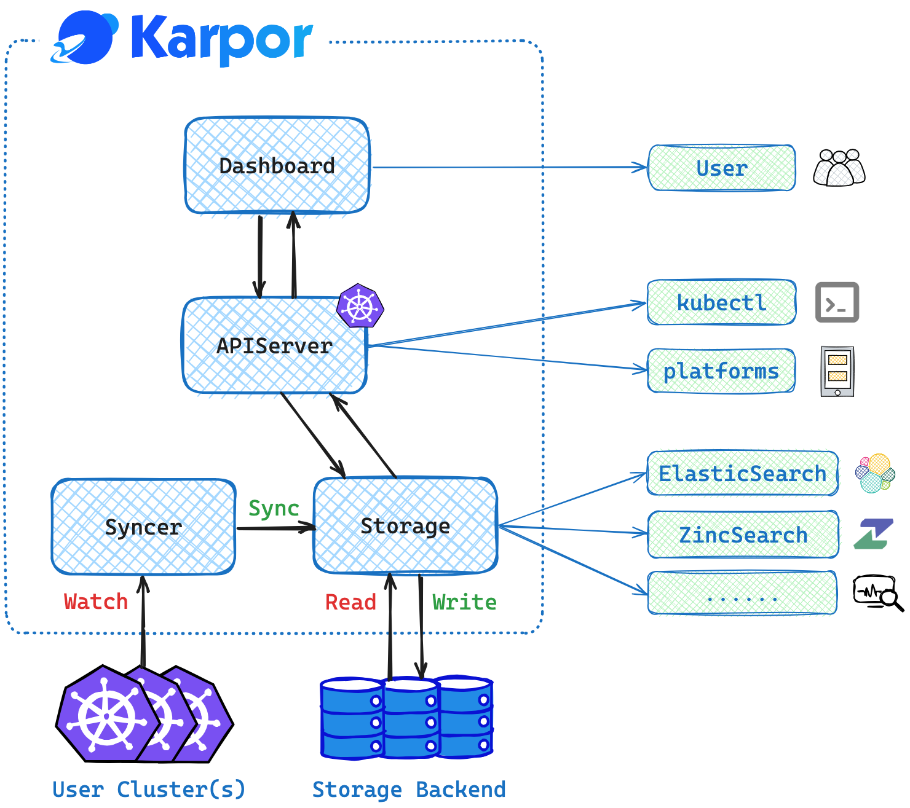

## 组件

-   `Dashboard`：Karpor 的 Web UI 界面。
-   `Server`：Karpor 的主后端服务器。
-   `Syncer`：独立服务器，用于实时同步集群资源。
-   `Storage`：存储后端，用于存储已同步的资源和用户数据。

## Karpor 的工作原理

1. 安装后，用户可以将感兴趣的集群注册到 Karpor 中。
2. Syncer 运行并自动将集群中感兴趣的资源同步到 Storage。它还确保将资源的实时变化自动同步到 Storage。
3. 当用户希望定位特定资源时，可以在 Dashboard 的搜索框中输入搜索语句查询。Dashboard 与 Server 的搜索接口进行交互。Server 内的搜索模块解析搜索语句，在 Storage 中搜索相关资源，并将结果返回给 Dashboard。
4. 点击搜索结果后，用户将被引导至资源洞察页面。Dashboard 调用 Server 的洞察接口，其中 Server 的洞察模块对资源进行静态扫描，生成问题报告，并定位其相关资源，以绘制包含所有父资源和子资源的资源拓扑图。
5. 洞察页面也适用于资源组，如集群中的所有资源、一组特定的 Group-Version-Kind 组合、一个命名空间或自定义定义的资源组。

## 下一步

- 学习 Karpor 的 [术语表](../concepts/glossary)。
- 查看 [用户指南](../user-guide/multi-cluster-management) 以了解更多关于您能够通过 Karpor 实现的内容。
