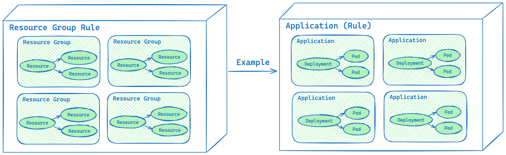

## 集群

等同于 `Kubernetes` 中的集群概念，例如名为 `democluster` 的集群。

`Karpor` 可以管理多个集群，包括集群注册、证书轮换、生成和查看洞察，以及通过 Dashboard 进行的其他操作。它还支持使用 `Karpor` 发放的统一证书，通过 `kubectl` 和 `kubectx` 等命令行工具访问任何被管理的集群。

更多细节，请参考最佳实践：[告别集群证书切换，让你“一卡通行”](../3-user-guide/5-best-production-practices/1-one-pass-with-proxy.md)。

## Hub cluster

管理其他集群的集群，在 `Karpor` 中指的是组件 `Server`。

## 资源

等同于 `Kubernetes` 中的资源概念，如名为 `mockDeployment` 的 `Deployment`。

`Karpor` 对其管理集群中的资源进行实时同步、搜索和洞察。资源是 `Karpor` 里搜索和洞察的最小粒度对象。

## 资源组

**资源组是一种逻辑上的组织结构**，用于将相关的 `Kubernetes` 资源组合起来，以便于更直观的查看、搜索和洞察。例如，可以创建一个名为 `mockapp` 的 `Application` 资源组，其中包括一个 `Namespace`、一个 `Deployment` 和多个具有特定标签（如 `app.kubernetes.io/name: mockapp`）的 `Pods`。

## 资源组规则

**资源组规则是一套规则**，将特定资源分组到适当的资源组中。这些规则旨在基于 `annotations`、`labels`、`namespace` 等属性，将资源组织成逻辑单元。例如，要定义一个应用程序资源组规则，可以指定 `annotations` 为 `app.kubernetes.io/name` 作为分组条件。
`Karpor` 预设了一个资源组规则 `Namespace` 以及自定义资源组规则。

## 拓扑

在 `Karpor` 中，拓扑是指**给定资源组内相关资源之间的关系和依赖**。利用可视化的拓扑图可以更容易地查看和理解资源组的内部结构，这对于故障排查和定位问题很有帮助。

## 审计

审计是指**对给定资源组内的所有资源执行合规性扫描**。其目的是帮助用户发现潜在风险。当前系统内置使用的扫描工具和规则，但我们将来会支持自定义方式进行扫描。

## 问题

**审计的输出被称为问题**。如果被扫描对象没有问题，则审计结果将为空。否则，所有识别到的风险将根据其风险等级进行分类并显示，包括每个风险的描述、相关资源等，用来指导用户解决问题，确保集群资源的安全和合规。

## 健康分

评分用于反映资源组或资源的**整体健康状况**，提醒用户及时调整和采取措施。健康评分是基于资源组的审计结果计算得出。影响评分的因素包括：**风险等级**、**风险数量**和**资源总数**。

## 下一步

- 学习 Karpor 的 [架构](../concepts/architecture)。
- 查看 [用户指南](../user-guide/multi-cluster-management)，了解更多有关你可以通过 Karpor 实现的内容。
