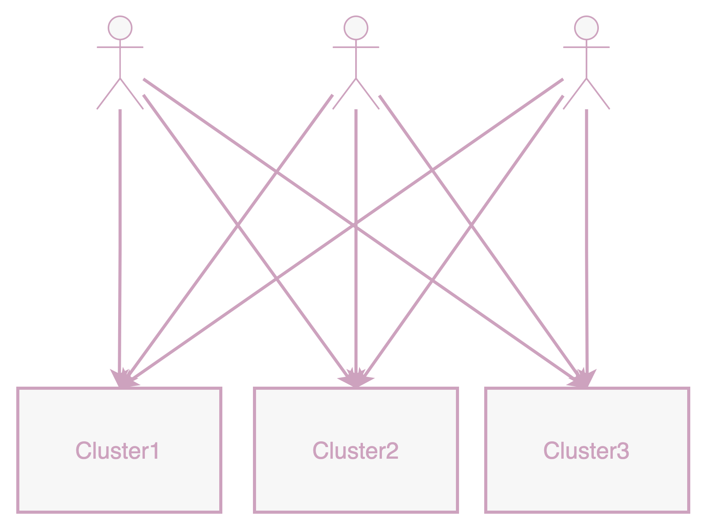
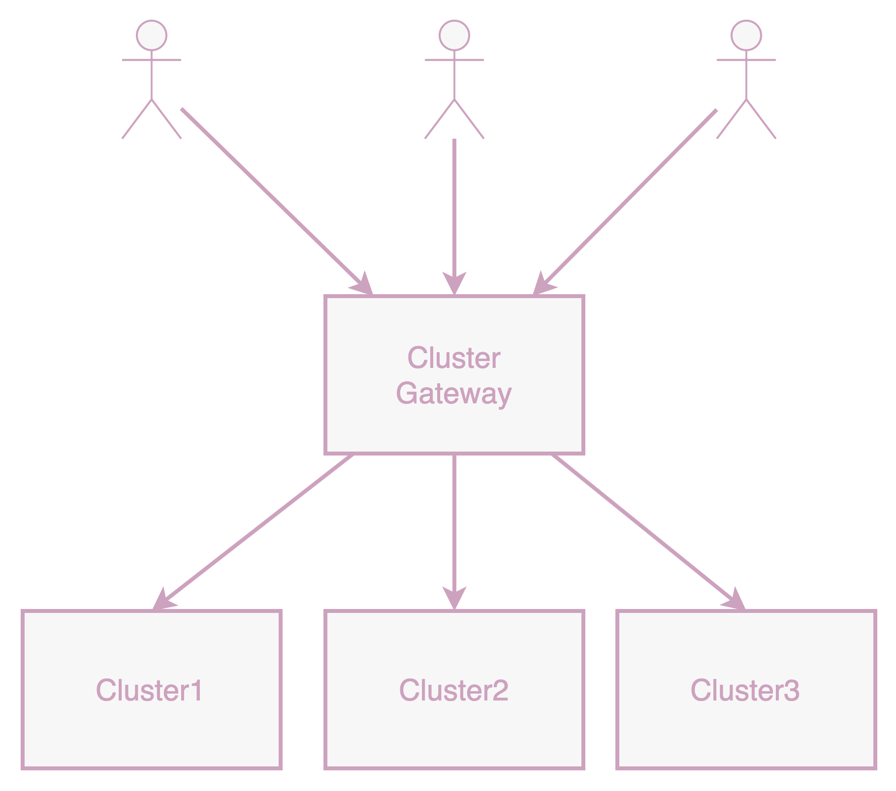
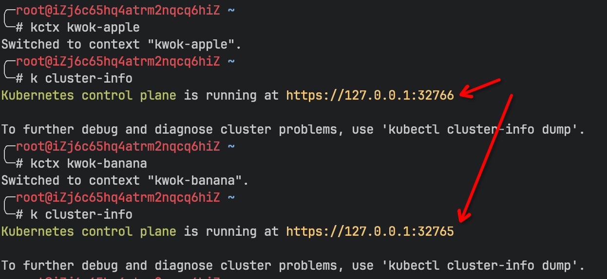

## 挑战与需求

### 大规模多集群的规模挑战

2014 年 6 月，Kubernetes 从 Google 的内部 Borg 项目诞生，引人注目地亮相。在科技巨头的支持和一个蓬勃发展的开源社区的帮助下，它逐渐成为了容器编排领域的事实标准。随着公司开始在生产环境中部署 Kubernetes，单个 Kubernetes 集群无法再满足内部日益复杂的需求。单个集群中的节点数量超过社区推荐的限制（5,000）是很常见的，使得扩展到多集群成为一个自然的选择。

### 多集群访问者的基本需求

随着多集群的蓬勃发展，各种平台可能需要跨不同集群访问资源，需要获取每个集群的 KubeConfig。

随着用户和集群数量的增加，集群管理员面临着巨大的时间成本：如果有`M`个集群和`N`个用户，管理 KubeConfig 的时间复杂度将变为`O (M*N)`。此外，用户在访问不同集群时需要切换不同的 KubeConfig，不同集群的 KubeConfig 对应的权限也各不相同，无疑增加了使用的复杂度。

在这种情况下，有没有一种方法能方便地访问不同集群中的资源，而无需维护大量的 KubeConfig 和管理跨集群的各种用户权限问题？此外，这种方法理想地应该是云原生的，可以通过 kubectl 和 Kubernetes 官方客户端访问，以降低过渡到使用这种方法的成本。`Karpor`的出现就是为了解决这些问题。

## "一站式通行" 的理念

我们开发了 `Karpor`，一个开源项目。作为一个 Kubernetes 资源探索器，在搜索和洞察集群资源方面具有独特优势，它的基础多集群管理组件，具备集群证书颁发和多集群请求代理的特点，使其高度适合作为平台对多个集群的统一访问入口。该组件支持以云原生方式转发用户请求到指定集群，允许用户维护一套 KubeConfig 来访问不同的集群，使访问多集群像访问单个集群一样简单。那么，它是如何工作的呢？下面，我们介绍`Karpor`的架构和功能。

### 多集群请求路由和代理

`Karpor`包含一个应用层网关，能够将任何 Kubernetes 风格的请求转发给指定的 Kubernetes 集群。`Karpor`也是基于 Kubernetes 框架开发的，作为 kube-apiserver，可以独立运行或作为现有 kube-apiserver 的扩展。`Karpor`支持处理两种类型的扩展资源：`Cluster`和 `Cluster/Proxy`，前者用于存储集群信息，后者用于将用户请求转发到特定集群。用户可以通过 Kubernetes 官方 CLI（`kubectl`）或 SDK（`client-go`、`client-java`等）进行访问。

`Karpor`将所有对`Cluster/Proxy`子资源的访问代理到目标集群。例如，要从`Cluster1`集群检索 Pod 信息，用户需要向`Karpor`发送`GET /apis/kusionstack.io/Cluster/cluster1/proxy/api/v1/pods`请求。`Karpor`将从`Cluster/Cluster1`资源生成一个 KubeConfig 以访问该集群，并将`/api/v1/pods`请求代理到 `Cluster1`集群。

### 支持所有 Kubernetes 原生请求

`Karpor`支持转发所有 kube-apiserver 请求。具体来说，`Karpor`是一个应用层网关，通过 HTTP connect 协议代理 HTTP 请求。除了支持对资源的`get`、`create`、`update`和`delete`操作外，它还支持`watch`、`log`、`exec`、`attach`等。（由于用于`exec`和`attach`的 SPDY 协议不支持 http2，`Karpor`在转发这些请求时会禁用 http2，切换到 http1.1 并支持 hijacker 处理）。

## 总结

从上文中可以看出，利用`Karpor`的多集群管理组件，为用户提供了一个可控权限的 “多集群通行证”。用户不再需要关心频繁切换集群证书和新集群的接入等问题。有了这个“一证通行”，访问多个集群的成本降低了，满足了大多数用户在多集群平台上的最基本需求。