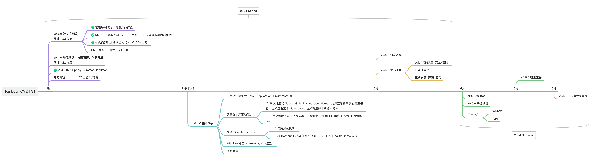

Karpor 是一个新兴的开源项目，我们致力于将其打磨成小巧精致且用户友好的产品。未来，我们将重点放在以下几个领域：

- 提升 Karpor 的**可用性**，降低入门门槛，确保其足够“用户友好”。
- 加强 Karpor 的**可靠性**，确保其在生产环境中可信赖。
- 深化与更多社区工具的**生态系统整合**，以确保开放性。
- 探索 **AI + Karpor**，创造更多可能性。
- 拥抱开源社区：我们热爱**开源精神**，如果你对开源感兴趣，那么从这里开始！

Karpor 遵循 [发布流程与节奏指南](../4-developer-guide/2-conventions/1-release-process.md)，但行动可能不会严格遵守路线图。我们可能会根据社区会议的反馈和 [GitHub 问题](https://github.com/KusionStack/karpor/issues) 调整里程碑，期望所有社区成员加入讨论。关于最终决策，请参考 [GitHub 里程碑](https://github.com/KusionStack/karpor/milestones)。

以下是详细的路线图，我们将持续更新 ⬇️

## 2024 年春夏路线图

