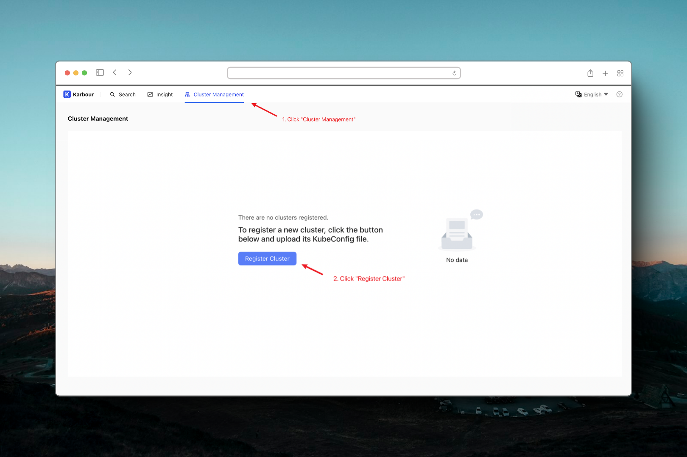
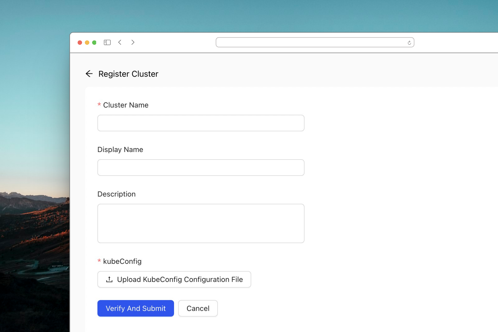
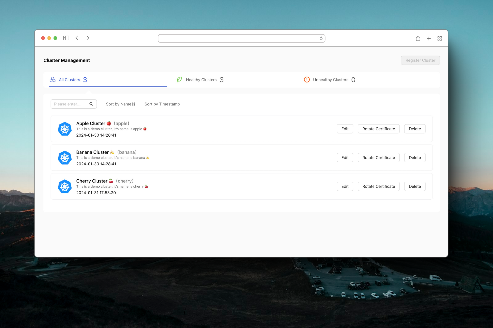
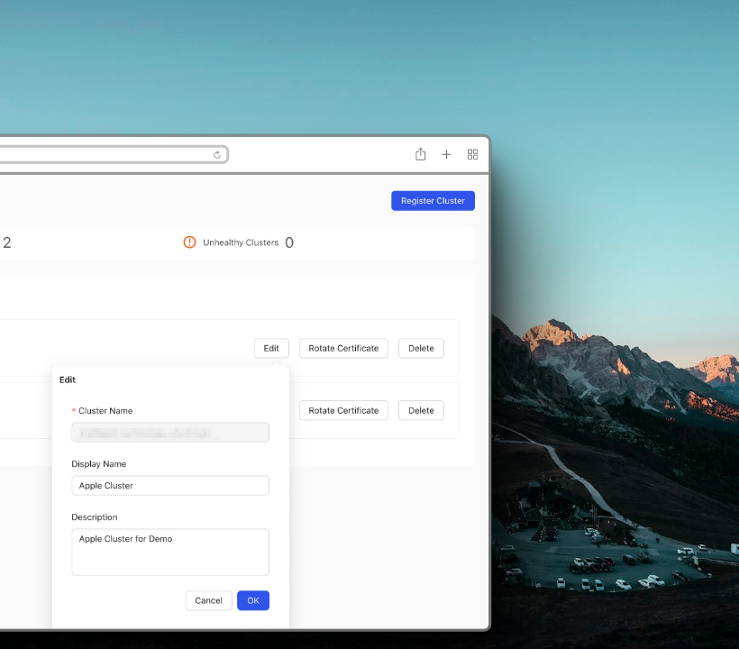
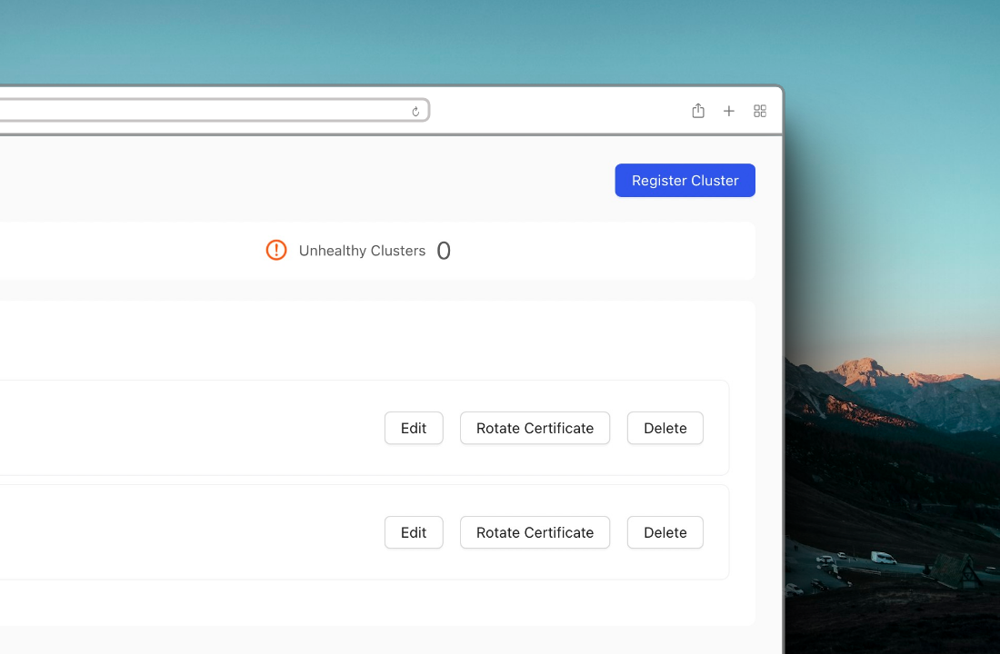
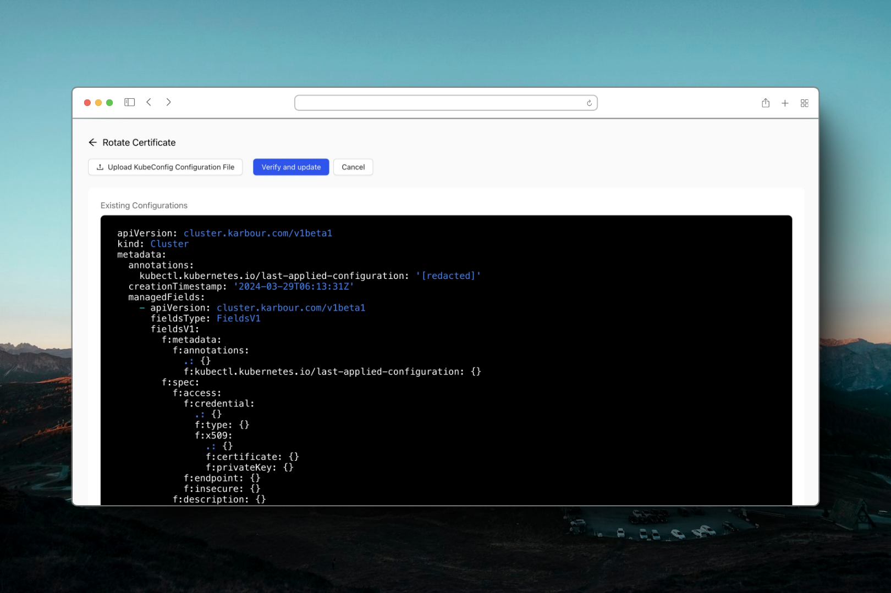
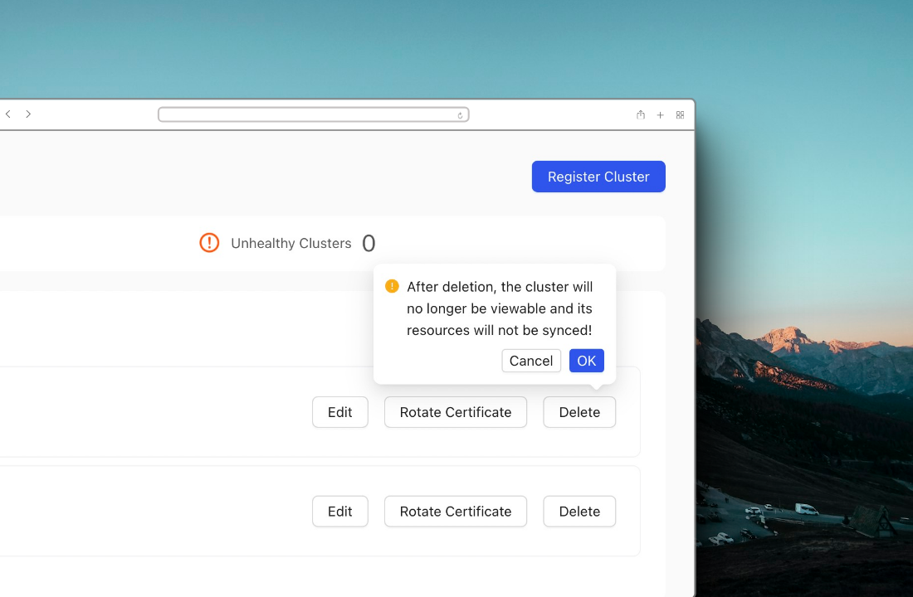

Multi-cluster management allows for the registration of clusters into Karpor, enabling the search and insight across a large number of clusters.

## Register Cluster

1. Click the `Cluster Management` Tab.
2. Click the `Register Cluster` button.
   
3. Input the cluster name. The cluster name must be unique and cannot be altered once created.
4. Upload the cluster's kubeconfig file. One with read permission is sufficient.
5. Click the `verify And Submit` button.
   
6. Once verified, the cluster will be added under the `Cluster Management` page
   

## Edit Cluster

The `Edit` button allows for modifications to the `Display Name` and `Description`, thus altering how the cluster's name and description appear on the frontend.

## Rotate Certificate

When the kubeconfig expires, you can update the certificate by clicking `Rotate Certificate`.

## Remove Cluster

The `delete` button facilitates the removal of a registered cluster.

